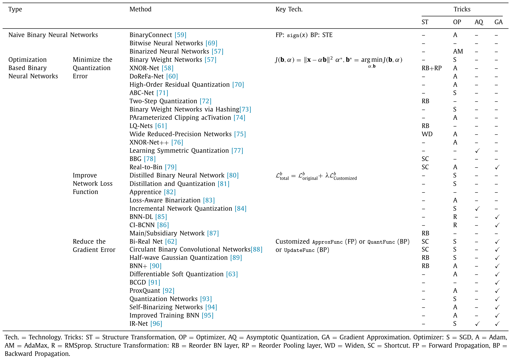

# Awesome Model Quantization 

This repo collects papers, docs, codes about model quantization for anyone who wants to do research on it. We are continuously improving the project. Welcome to PR the works (papers, repositories) that are missed by the repo.

## Table of Contents

- [Survey of BNN](#Survey\_of\_BNN)
- [Papers](#Papers)
	- [2020](#2020)
	- [2019](#2019)
	- [2018](#2018)
	- [2017](#2017)
	- [Ealier](#2016)
- [Codes and Docs](#Codes\_and\_Docs)
- [Our Team](#Our_Team)

## Survey_of_BNN

Our survey paper **Binary Neural Networks: A Survey** (*Pattern Recognition*) is a comprehensive survey of recent progress in binary neural networks. For details, please refer to:

**Binary Neural Networks: A Survey**  [[Paper](https://arxiv.org/abs/2004.03333)]  [[Blog](https://mp.weixin.qq.com/s/QGva6fow9tad_daZ_G2p0Q)]

[**Haotong Qin**](https://htqin.github.io/), [Ruihao Gong](https://xhplus.github.io/), [Xianglong Liu*](http://sites.nlsde.buaa.edu.cn/~xlliu/), Xiao Bai, [Jingkuan Song](https://cfm.uestc.edu.cn/~songjingkuan/), and [Nicu Sebe](https://disi.unitn.it/~sebe/).

Bibtex
<pre><code>@article{Qin:pr20_bnn_survey,
	title = "Binary neural networks: A survey",
	author = "Haotong Qin and Ruihao Gong and Xianglong Liu and Xiao Bai and Jingkuan Song and Nicu Sebe",
	journal = "Pattern Recognition",
	volume = "105",
	pages = "107281",
	year = "2020"
}</code></pre>

## Papers

**Keywords**: **`low-bit`**: Low-bit Quantization | **`binarization`** | **`hardware`** | **`nlp`**: Based on Natural Language Processing Models | __`other`__: Other Relative Methods 

**Statistics**:  :fire: highly cited | :star: code is available and star > 50

------

### 2020

- [[ACL](https://www.aclweb.org/anthology/2020.sustainlp-1.4.pdf)] End to End Binarized Neural Networks for Text Classification. [**`binarization`**] <!--citation 0-->
- [[AAAI](https://arxiv.org/abs/1909.05840)] [72:fire:] Q-BERT: Hessian Based Ultra Low Precision Quantization of BERT.  [__`low-bit`__] [**`nlp`**]
- [[AAAI](https://aaai.org/ojs/index.php/AAAI/article/view/6900)] Sparsity-Inducing Binarized Neural Networks. [**`binarization`**] 
- [[AAAI](https://aaai.org/ojs/index.php/AAAI/article/view/6134)] Towards Accurate Low Bit-Width Quantization with Multiple Phase Adaptations. 
- [[COOL CHIPS](https://ieeexplore.ieee.org/document/9097642/)] A Novel In-DRAM Accelerator Architecture for Binary Neural Network.  [**`hardware`**]  <!--citation 0-->
- [[CoRR](https://arxiv.org/pdf/2002.10778.pdf)] Training Binary Neural Networks using the Bayesian Learning Rule. [**`binarization`**] 
- [[CVPR](https://openaccess.thecvf.com/content_CVPR_2020/papers/Han_GhostNet_More_Features_From_Cheap_Operations_CVPR_2020_paper.pdf)] [47:fire:] GhostNet: More Features from Cheap Operations.  [__`low-bit`__] [[tensorflow & torch](https://github.com/huawei-noah/ghostnet)] [1.2k:star:]   <!--citation 47-->
- [[CVPR](https://openaccess.thecvf.com/content_CVPR_2020/papers/Qin_Forward_and_Backward_Information_Retention_for_Accurate_Binary_Neural_Networks_CVPR_2020_paper.pdf)] Forward and Backward Information Retention for Accurate Binary Neural Networks. [**`binarization`**] [[torch](https://github.com/htqin/IR-Net)] [105:star:] <!--citation 14-->
- [[CVPR](https://openaccess.thecvf.com/content_CVPR_2020/papers/Wang_APQ_Joint_Search_for_Network_Architecture_Pruning_and_Quantization_Policy_CVPR_2020_paper.pdf)] APQ: Joint Search for Network Architecture, Pruning and Quantization Policy. [__`low-bit`__] [[torch](https://github.com/mit-han-lab/apq)] [76:star:]
- [[CVPR](https://openaccess.thecvf.com/content_CVPR_2020/papers/Wu_Rotation_Consistent_Margin_Loss_for_Efficient_Low-Bit_Face_Recognition_CVPR_2020_paper.pdf)] Rotation Consistent Margin Loss for Efficient Low-Bit Face Recognition. [__`low-bit`__] 
- [[CVPR](https://openaccess.thecvf.com/content_CVPR_2020/papers/Wang_BiDet_An_Efficient_Binarized_Object_Detector_CVPR_2020_paper.pdf)] BiDet: An Efficient Binarized Object Detector.  [ **`binarization`** ]  [[torch](https://github.com/ZiweiWangTHU/BiDet)] [112:star:] <!--citation 3-->
- [[CVPR](https://openaccess.thecvf.com/content_CVPR_2020/papers/Zhang_Fixed-Point_Back-Propagation_Training_CVPR_2020_paper.pdf)] Fixed-Point Back-Propagation Training. [[video](https://www.youtube.com/watch?v=nVRNygIQKI0)] [__`low-bit`__]
- [[CVPR](https://openaccess.thecvf.com/content_CVPRW_2020/papers/w40/Yu_Low-Bit_Quantization_Needs_Good_Distribution_CVPRW_2020_paper.pdf)] Low-Bit Quantization Needs Good Distribution.  [**`low-bit`**] <!--citation 1-->
- [[DATE](https://ieeexplore.ieee.org/document/9116220)] BNNsplit: Binarized Neural Networks for embedded distributed FPGA-based computing systems. [**`binarization`**] <!--citation 1-->
- [[DATE](https://arxiv.org/abs/1912.04050)] PhoneBit: Efficient GPU-Accelerated Binary Neural Network Inference Engine for Mobile Phones.  [**`binarization`**] [**`hardware`**] 
- [[DATE](https://ieeexplore.ieee.org/abstract/document/9116308)] OrthrusPE: Runtime Reconfigurable Processing Elements for Binary Neural Networks. [**`binarization`**] <!--citation 2-->
- [[ECCV](https://arxiv.org/abs/2002.06963)] Learning Architectures for Binary Networks. [**`binarization`**] [[torch](https://github.com/gistvision/bnas)] <!--citation 5-->
- [[ECCV](https://www.ecva.net/papers/eccv_2020/papers_ECCV/papers/123510426-supp.pdf)]PROFIT: A Novel Training Method for sub-4-bit MobileNet Models. [**`low-bit`**] <!--citation 2-->
- [[ECCV](https://www.ecva.net/papers/eccv_2020/papers_ECCV/papers/123480222.pdf)] ProxyBNN: Learning Binarized Neural Networks via Proxy Matrices. [**`binarization`**] <!--citation 2-->
- [[ECCV](https://www.ecva.net/papers/eccv_2020/papers_ECCV/papers/123590137.pdf)] ReActNet: Towards Precise Binary Neural Network with Generalized Activation Functions. [**`binarization`**] [[torch](https://github.com/liuzechun/ReActNet)] [108:star:]  <!--citation 7-->
- [[EMNLP](https://arxiv.org/abs/2009.12812)] TernaryBERT: Distillation-aware Ultra-low Bit BERT. [**`low-bit`**] [**`nlp`**]
- [[EMNLP](https://arxiv.org/abs/1910.10485)] Fully Quantized Transformer for Machine Translation. [**`low-bit`**] [**`nlp`**]
- [[ICET](https://ieeexplore.ieee.org/document/9119704)] An Energy-Efficient Bagged Binary Neural Network Accelerator. [**`binarization`**]  [**`hardware`**]  <!--citation 0-->
- [[ICASSP](https://ieeexplore.ieee.org/document/9054599)] Balanced Binary Neural Networks with Gated Residual. [**`binarization`**]  <!--citation 3-->
- [[ICML](https://proceedings.icml.cc/static/paper_files/icml/2020/181-Paper.pdf)] Training Binary Neural Networks through Learning with Noisy Supervision. [**`binarization`**]  <!--citation 5-->
- [[ICLR](https://xhplus.github.io/publication/conference-paper/iclr2020/dms/DMS.pdf)] DMS: Differentiable Dimension Search for Binary Neural Networks.  [**`binarization`**] 
- [[ICLR]()] [19:fire:] Training Binary Neural Networks with Real-to-Binary Convolutions. [**`binarization`**] [[code is comming](https://github.com/brais-martinez/real2binary)] [[re-implement](https://github.com/larq/zoo/blob/master/larq_zoo/literature/real_to_bin_nets.py)] <!--citation 19-->
- [[ICLR](https://arxiv.org/abs/2002.06517)] BinaryDuo: Reducing Gradient Mismatch in Binary Activation Network by Coupling Binary Activations. [**`binarization`**] [[torch](https://github.com/Hyungjun-K1m/BinaryDuo)] <!--citation 6-->
- [[IJCV](https://arxiv.org/abs/2009.04247)] Binarized Neural Architecture Search for Efficient Object Recognition. [**`binarization`**] <!--citation 0-->
- [[IJCAI](https://arxiv.org/pdf/2005.00057.pdf)] CP-NAS: Child-Parent Neural Architecture Search for Binary Neural Networks.  [**`binarization`**] 
- [[IJCAI](https://www.ijcai.org/Proceedings/2020/0520.pdf)] Towards Fully 8-bit Integer Inference for the Transformer Model. [**`low-bit`**] [**`nlp`**] 
- [[IJCAI](https://www.ijcai.org/proceedings/2020/318)] Soft Threshold Ternary Networks.  [**`low-bit`**]
- [[IJCAI](https://www.ijcai.org/proceedings/2020/121)] Overflow Aware Quantization: Accelerating Neural Network Inference by Low-bit Multiply-Accumulate Operations.  [**`low-bit`**]
- [[IJCAI](https://www.ijcai.org/proceedings/2020/292)] Direct Quantization for Training Highly Accurate Low Bit-width Deep Neural Networks.  [**`low-bit`**] 
- [[IJCAI](https://www.ijcai.org/proceedings/2020/288)] Fully Nested Neural Network for Adaptive Compression and Quantization. [**`low-bit`**] 
- [[ISCAS](https://arxiv.org/pdf/2004.08914.pdf)] MuBiNN: Multi-Level Binarized Recurrent Neural Network for EEG Signal Classification. [**`binarization`**] <!--citation 0-->
- [[ISQED](https://ieeexplore.ieee.org/document/9136977)] BNN Pruning: Pruning Binary Neural Network Guided by Weight Flipping Frequency. [**`binarization`**] [[torch](https://github.com/PSCLab-ASU/BNNPruning)] <!--citation 0-->
- [[MICRO](http://arxiv.org/abs/2005.03842)] GOBO: Quantizing Attention-Based NLP Models for Low Latency and Energy Efficient Inference. [**`low-bit`**] [**`nlp`**] 
- [[MLST](https://arxiv.org/abs/2003.06308)] Compressing deep neural networks on FPGAs to binary and ternary precision with HLS4ML. [**`hardware`**]  [**`binarization`**]  [**`low-bit`**] <!--citation 11-->
- [[NeurIPS](https://papers.nips.cc/paper/2020/file/53c5b2affa12eed84dfec9bfd83550b1-Paper.pdf)] Rotated Binary Neural Network. [**`binarization`**] [[torch](https://github.com/lmbxmu/RBNN)]
- [[NeurIPS](https://proceedings.neurips.cc/paper/2020/file/2a084e55c87b1ebcdaad1f62fdbbac8e-Paper.pdf)] Searching for Low-Bit Weights in Quantized Neural Networks. [**`low-bit`**] [[torch](https://github.com/zhaohui-yang/Binary-Neural-Networks/tree/main/SLB)]  <!--citation 4-->
- [[NeurIPS](https://proceedings.neurips.cc/paper/2020/hash/92049debbe566ca5782a3045cf300a3c-Abstract.html)] Universally Quantized Neural Compression.  [**`low-bit`**]
- [[NeurIPS](https://proceedings.neurips.cc/paper/2020/hash/1385974ed5904a438616ff7bdb3f7439-Abstract.html)] Efficient Exact Verification of Binarized Neural Networks. [**`binarization`**] [[torch](https://github.com/jia-kai/eevbnn)]
- [[NeurIPS](https://proceedings.neurips.cc/paper/2020/hash/96fca94df72984fc97ee5095410d4dec-Abstract.html)] Path Sample-Analytic Gradient Estimators for Stochastic Binary Networks. [**`binarization`**] [[code](https://github.com/shekhovt/PSA-Neurips2020)]
- [[NeurIPS](https://proceedings.neurips.cc/paper/2020/hash/d77c703536718b95308130ff2e5cf9ee-Abstract.html)] HAWQ-V2: Hessian Aware trace-Weighted Quantization of Neural Networks.  [**`low-bit`**] 
- [[NeurIPS](https://proceedings.neurips.cc/paper/2020/hash/3f13cf4ddf6fc50c0d39a1d5aeb57dd8-Abstract.html)] Bayesian Bits: Unifying Quantization and Pruning. [**`low-bit`**]
- [[NeurIPS](https://proceedings.neurips.cc/paper/2020/hash/3948ead63a9f2944218de038d8934305-Abstract.html)] Robust Quantization: One Model to Rule Them All. [**`low-bit`**]
- [[NeurIPS](https://proceedings.neurips.cc/paper/2020/hash/26ed695e9b7b9f6463ef4bc1fd74fc87-Abstract.html)] Closing the Dequantization Gap: PixelCNN as a Single-Layer Flow. [**`low-bit`**] [[torch](https://github.com/didriknielsen/pixelcnn_flow)]
- [[NeurIPS](https://proceedings.neurips.cc/paper/2020/hash/20b5e1cf8694af7a3c1ba4a87f073021-Abstract.html)] Adaptive Gradient Quantization for Data-Parallel SGD. [**`low-bit`**] [[torch](https://github.com/tabrizian/learning-to-quantize)]
- [[NeurIPS](https://proceedings.neurips.cc/paper/2020/hash/0e230b1a582d76526b7ad7fc62ae937d-Abstract.html)] FleXOR: Trainable Fractional Quantization. [**`low-bit`**]
- [[NeurIPS](http://arxiv.org/abs/2005.11035)] Position-based Scaled Gradient for Model Quantization and Pruning.  [**`low-bit`**] [[torch](https://github.com/Jangho-Kim/PSG-pytorch)] 
- [[NN](https://www.sciencedirect.com/science/article/abs/pii/S0893608019304290?via%3Dihub)] Training high-performance and large-scale deep neural networks with full 8-bit integers. [**`low-bit`**] <!--citation 13-->
- [[Neurocomputing](https://www.sciencedirect.com/science/article/abs/pii/S0925231219314274)] Eye localization based on weight binarization cascade convolution neural network. [**`binarization`**]
- [[PR](https://arxiv.org/abs/2004.03333)] [23:fire:] Binary neural networks: A survey. [**`binarization`**]  <!--citation 23-->
- [[PR Letters](https://arxiv.org/abs/2008.01438)] Controlling information capacity of binary neural network. [**`binarization`**]   <!--citation 0-->
- [[SysML](https://ubicomplab.cs.washington.edu/pdfs/riptide.pdf)] Riptide: Fast End-to-End Binarized Neural Networks. [**`low-bit`**]  [[tensorflow](https://github.com/jwfromm/Riptide)] [129:star:] <!--citation 5-->
- [[TVLSI](https://arxiv.org/pdf/2003.02628.pdf)] Phoenix: A Low-Precision Floating-Point Quantization Oriented Architecture for Convolutional Neural Networks. [**`low-bit`**] <!--citation 0-->
- [[WACV](https://openaccess.thecvf.com/content_WACV_2020/papers/Phan_MoBiNet_A_Mobile_Binary_Network_for_Image_Classification_WACV_2020_paper.pdf)] MoBiNet: A Mobile Binary Network for Image Classification. [**`binarization`**] <!--citation 11-->
- [[IEEE Access](https://ieeexplore.ieee.org/document/9091590/)] An Energy-Efficient and High Throughput in-Memory Computing Bit-Cell With Excellent Robustness Under Process Variations for Binary Neural Network. [**`binarization`**]  [**`hardware`**]  <!--citation 0-->
- [[IEEE Trans. Magn](https://arxiv.org/abs/2003.05132)] SIMBA: A Skyrmionic In-Memory Binary Neural Network Accelerator.  [**`binarization`**] <!--citation 0-->
- [[IEEE TCS.II](https://ieeexplore.ieee.org/document/9144282/)] A Resource-Efficient Inference Accelerator for Binary Convolutional Neural Networks.  [**`hardware`**]  <!--citation 1-->
- [[IEEE TCS.I](https://arxiv.org/pdf/2003.12558.pdf)] IMAC: In-Memory Multi-Bit Multiplication and ACcumulation in 6T SRAM Array.  [**`low-bit`**] <!--citation 3-->
- [[IEEE Trans. Electron Devices](https://ieeexplore.ieee.org/document/9112690)] Design of High Robustness BNN Inference Accelerator Based on Binary Memristors. [**`binarization`**]  [**`hardware`**] <!--citation 0-->
- [[arxiv](https://arxiv.org/abs/2004.07320)] Training with Quantization Noise for Extreme Model Compression. [**`low-bit`**] [[torch](https://github.com/pytorch/fairseq/tree/master/examples/quant_noise)] 
- [[arxiv](https://arxiv.org/pdf/2004.11147.pdf)] Binarized Graph Neural Network. [**`binarization`**] <!--citation 0-->
- [[arxiv](https://arxiv.org/pdf/1909.09139.pdf)] How Does Batch Normalization Help Binary Training? [**`binarization`**] <!--citation 5-->
- [[arxiv](https://arxiv.org/pdf/2007.05223.pdf)] Distillation Guided Residual Learning for Binary Convolutional Neural Networks. [**`binarization`**] <!--citation 1-->
- [[arxiv](https://arxiv.org/abs/2006.16578)] Accelerating Binarized Neural Networks via Bit-Tensor-Cores in Turing GPUs.  [**`binarization`**] [[code](https://github.com/pnnl/TCBNN)] <!--citation 1-->
- [[arxiv](https://arxiv.org/abs/2001.05936)] MeliusNet: Can Binary Neural Networks Achieve MobileNet-level Accuracy?  [**`binarization`**] [[code](https://github.com/hpi-xnor/BMXNet-v2)] [192:star:] <!--citation 13-->
- [[arxiv](https://arxiv.org/pdf/2001.01091.pdf)] RPR: Random Partition Relaxation for Training; Binary and Ternary Weight Neural Networks.  [**`binarization`**] [**`low-bit`**] <!--citation 3-->
- [[paper](https://www.researchgate.net/publication/343568789_Towards_Lossless_Binary_Convolutional_Neural_Networks_Using_Piecewise_Approximation)] Towards Lossless Binary Convolutional Neural Networks Using Piecewise Approximation.  [**`binarization`**]  <!--citation 2-->
- [[arxiv](https://arxiv.org/abs/2006.07522)] Understanding Learning Dynamics of Binary Neural Networks via Information Bottleneck. [**`binarization`**] <!--citation 0-->
- [[arxiv](https://arxiv.org/abs/2012.15701)] BinaryBERT: Pushing the Limit of BERT Quantization.  [**`binarization`**] [**`nlp`**]

### 2019

- [[AAAI](https://www.aaai.org/ojs/index.php/AAAI/article/view/4273/4151)] Efficient Quantization for Neural Networks with Binary Weights and Low Bitwidth Activations. [**`low-bit`**]  [**`binarization`**]
- [[AAAI](https://www.aaai.org/ojs/index.php/AAAI/article/view/4848/4721)] [31:fire:]  Projection Convolutional Neural Networks for 1-bit CNNs via Discrete Back Propagation.  [**`binarization`**] 
- [[APCCAS](https://ieeexplore.ieee.org/document/8953134/)] Using Neuroevolved Binary Neural Networks to solve reinforcement learning environments. [**`binarization`**] [[code](https://github.com/rval735/BiSUNA)] 
- [[BMVC](https://arxiv.org/abs/1909.13863)] [32:fire:] XNOR-Net++: Improved Binary Neural Networks. [**`binarization`**]
- [[BMVC](https://arxiv.org/abs/1909.11366)] Accurate and Compact Convolutional Neural Networks with Trained Binarization.  [**`binarization`**] 
- [[CoRR](https://arxiv.org/abs/1908.07748)] RBCN: Rectified Binary Convolutional Networks for Enhancing the Performance of 1-bit DCNNs.  [**`binarization`**] 
- [[CoRR](https://arxiv.org/abs/1912.10103)] TentacleNet: A Pseudo-Ensemble Template for Accurate Binary Convolutional Neural Networks. [**`binarization`**]
- [[CoRR](http://arxiv.org/abs/1904.05868)] Improved training of binary networks for human pose estimation and image recognition. [**`binarization`**] 
- [[CoRR](https://arxiv.org/abs/1911.10862)] Binarized Neural Architecture Search. [**`binarization`**]
- [[CoRR](https://arxiv.org/pdf/1904.07852.pdf)] Matrix and tensor decompositions for training binary neural networks.  [**`binarization`**] 
- [[CoRR](https://arxiv.org/pdf/1906.08637.pdf)] Back to Simplicity: How to Train Accurate BNNs from Scratch?  [**`binarization`**] [[code](https://github.com/hpi-xnor/BMXNet-v2)] [193:star:]
- [[CVPR](https://openaccess.thecvf.com/content_CVPR_2019/papers/Zhuang_Structured_Binary_Neural_Networks_for_Accurate_Image_Classification_and_Semantic_CVPR_2019_paper.pdf)] [53:fire:] Structured Binary Neural Networks for Accurate Image Classification and Semantic Segmentation. [**`binarization`**] 
- [[CVPR](https://openaccess.thecvf.com/content_CVPR_2019/papers/Cao_SeerNet_Predicting_Convolutional_Neural_Network_Feature-Map_Sparsity_Through_Low-Bit_Quantization_CVPR_2019_paper.pdf)] SeerNet: Predicting Convolutional Neural Network Feature-Map Sparsity Through Low-Bit Quantization. [**`low-bit`**] 
- [[CVPR](https://openaccess.thecvf.com/content_CVPR_2019/papers/Wang_HAQ_Hardware-Aware_Automated_Quantization_With_Mixed_Precision_CVPR_2019_paper.pdf)] [218:fire:] HAQ: Hardware-Aware Automated Quantization with Mixed Precision. [**`low-bit`**] [**`hardware`**] [[torch](https://github.com/mit-han-lab/haq)] [233:star:]
- [[CVPR](https://openaccess.thecvf.com/content_CVPR_2019/papers/Yang_Quantization_Networks_CVPR_2019_paper.pdf)] [48:fire:]  Quantization Networks.  [**`binarization`**] [[torch](https://github.com/aliyun/alibabacloud-quantization-networks)] [82:star:]
- [[CVPR](https://arxiv.org/pdf/1904.05868.pdf)] Fully Quantized Network for Object Detection. [**`low-bit`**] 
- [[CVPR](https://openaccess.thecvf.com/content_CVPR_2019/papers/Wang_Learning_Channel-Wise_Interactions_for_Binary_Convolutional_Neural_Networks_CVPR_2019_paper.pdf)] Learning Channel-Wise Interactions for Binary Convolutional Neural Networks. [**`binarization`**] 
- [[CVPR](https://openaccess.thecvf.com/content_CVPR_2019/papers/Liu_Circulant_Binary_Convolutional_Networks_Enhancing_the_Performance_of_1-Bit_DCNNs_CVPR_2019_paper.pdf)] [31:fire:] Circulant Binary Convolutional Networks: Enhancing the Performance of 1-bit DCNNs with Circulant Back Propagation. [**`binarization`**] 
- [[CVPR](https://openaccess.thecvf.com/content_CVPR_2019/papers/Ding_Regularizing_Activation_Distribution_for_Training_Binarized_Deep_Networks_CVPR_2019_paper.pdf)] [36:fire:] Regularizing Activation Distribution for Training Binarized Deep Networks.  [**`binarization`**]  
- [[CVPR](https://openaccess.thecvf.com/content_CVPR_2019/papers/Xu_A_MainSubsidiary_Network_Framework_for_Simplifying_Binary_Neural_Networks_CVPR_2019_paper.pdf)] A Main/Subsidiary Network Framework for Simplifying Binary Neural Network. [**`binarization`**] 
- [[CVPR](https://openaccess.thecvf.com/content_CVPR_2019/papers/Zhu_Binary_Ensemble_Neural_Network_More_Bits_per_Network_or_More_CVPR_2019_paper.pdf)] Binary Ensemble Neural Network: More Bits per Network or More Networks per Bit? [**`binarization`**] 
- [[FPGA](https://arxiv.org/abs/1810.02068)] Towards Fast and Energy-Efficient Binarized Neural Network Inference on FPGA.  [**`binarization`**]  [**`hardware`**] 
- [[GLSVLSI](https://dl.acm.org/doi/pdf/10.1145/3299874.3318034)] Binarized Depthwise Separable Neural Network for Object Tracking in FPGA.  [**`binarization`**]  [**`hardware`**]
- [[ICCV](https://arxiv.org/abs/1908.05033)] [55:fire:] Differentiable Soft Quantization: Bridging Full-Precision and Low-Bit Neural Networks. [**`low-bit`**]  
- [[ICCV](https://arxiv.org/pdf/1908.06314.pdf)] Bayesian optimized 1-bit cnns.  [**`binarization`**]
- [[ICCV](https://openaccess.thecvf.com/content_ICCVW_2019/papers/NeurArch/Shen_Searching_for_Accurate_Binary_Neural_Architectures_ICCVW_2019_paper.pdf)] Searching for Accurate Binary Neural Architectures. [**`binarization`**] 
- [[ICML](https://arxiv.org/abs/1906.00532v2)] Efficient 8-Bit Quantization of Transformer Neural Machine Language Translation Model.  [**`low-bit`**] [**`nlp`**]
- [[ICLR](https://openreview.net/pdf?id=HyzMyhCcK7)] [37:fire:] ProxQuant: Quantized Neural Networks via Proximal Operators.  [**`binarization`**]  [**`low-bit`**] [[torch](https://github.com/allenbai01/ProxQuant)] 
- [[ICLR](https://openreview.net/pdf?id=rJfUCoR5KX)] An Empirical study of Binary Neural Networks' Optimisation.  [**`binarization`**]  
- [[ICIP](https://researchspace.auckland.ac.nz/bitstream/handle/2292/50394/APCCAS2019.pdf?sequence=2)] Training Accurate Binary Neural Networks from Scratch.  [**`binarization`**] [[code](https://github.com/hpi-xnor/BMXNet-v2)] [192:star:]
- [[ICUS](https://ieeexplore.ieee.org/document/8996039/)] Balanced Circulant Binary Convolutional Networks. [**`binarization`**] 
- [[IJCAI](https://see.xidian.edu.cn/faculty/chdeng/Welcome%20to%20Cheng%20Deng's%20Homepage_files/Papers/Conference/IJCAI2019_Feng.pdf)] Binarized Neural Networks for Resource-Efficient Hashing with Minimizing Quantization Loss. [**`binarization`**]
- [[IJCAI](https://www.ijcai.org/Proceedings/2019/0667.pdf)] Binarized Collaborative Filtering with Distilling Graph Convolutional Network.  [**`binarization`**]  
- [[IJCAI](https://www.ijcai.org/Proceedings/2019/0667.pdf)] Binarized Collaborative Filtering with Distilling Graph Convolutional Networks.  [**`binarization`**]
- [[ISOCC](https://ieeexplore.ieee.org/document/9027649)] Dual Path Binary Neural Network.  [**`binarization`**] 
- [[IEEE J. Emerg. Sel. Topics Circuits Syst.](https://ieeexplore.ieee.org/document/8668446/)] Hyperdrive: A Multi-Chip Systolically Scalable Binary-Weight CNN Inference Engine.  [**`hardware`**] 
- [[IEEE JETC](https://arxiv.org/pdf/1807.07928.pdf)] [128:fire:] Eyeriss v2: A Flexible Accelerator for Emerging Deep Neural Networks on Mobile Devices. [**`hardware`**]  
- [[IEEE J. Solid-State Circuits](https://ieeexplore.ieee.org/document/8581485)] An Energy-Efficient Reconfigurable Processor for Binary-and Ternary-Weight Neural Networks With Flexible Data Bit Width. [**`binarization`**]  [**`low-bit`**]
- [[MDPI Electronics](https://doi.org/10.3390/electronics8060661)] A Review of Binarized Neural Networks.  [**`binarization`**] 
- [[NeurIPS](https://csyhhu.github.io/data/MetaQuant.pdf)] MetaQuant: Learning to Quantize by Learning to Penetrate Non-differentiable Quantization. [**`low-bit`**] [[torch](https://github.com/csyhhu/MetaQuant)]
- [[NeurIPS](https://papers.nips.cc/paper/2019/file/9ca8c9b0996bbf05ae7753d34667a6fd-Paper.pdf)] Latent Weights Do Not Exist: Rethinking Binarized Neural Network Optimization.  [**`binarization`**] [[tensorflow](https://github.com/plumerai/rethinking-bnn-optimization)] 
- [[NeurIPS](http://arxiv.org/abs/1812.11800)] [43:fire:]  Regularized Binary Network Training. [**`binarization`**] 
- [[NeurIPS](https://www.emc2-ai.org/assets/docs/neurips-19/emc2-neurips19-paper-31.pdf)] [44:fire:] Q8BERT: Quantized 8Bit BERT.  [**`low-bit`**] [**`nlp`**] 
- [[NeurIPS](https://www.emc2-ai.org/assets/docs/neurips-19/emc2-neurips19-paper-36.pdf)] Fully Quantized Transformer for Improved Translation.  [**`low-bit`**] [**`nlp`**] 
- [[RoEduNet](https://ieeexplore.ieee.org/document/8909493/)] PXNOR: Perturbative Binary Neural Network.  [**`binarization`**] [[code](https://github.com/Apfelin/PXNOR)] 
- [[SiPS](https://arxiv.org/abs/1909.01688)] Knowledge distillation for optimization of quantized deep neural networks. [**`low-bit`**]  
- [[TMM](https://arxiv.org/abs/1708.05127)] [45:fire:] Deep Binary Reconstruction for Cross-Modal Hashing. [**`binarization`**] 
- [[TMM](https://arxiv.org/pdf/1712.02956.pdf)] Compact Hash Code Learning With Binary Deep Neural Network.  [**`binarization`**] 
- [[TMM](https://arxiv.org/pdf/1712.02956.pdf)] Compact Hash Code Learning With Binary Deep Neural Network.  [**`binarization`**]
- [[IEEE TCS.I](https://arxiv.org/pdf/1807.00343.pdf)] Xcel-RAM: Accelerating Binary Neural Networks in High-Throughput SRAM Compute Arrays.  [**`hardware`**]
- [[IEEE TCS.I](https://ieeexplore.ieee.org/abstract/document/8643565)] Recursive Binary Neural Network Training Model for Efficient Usage of On-Chip Memory. [**`binarization`**] 
- [[VLSI-SoC](https://ieeexplore.ieee.org/document/8920343/)] A Product Engine for Energy-Efficient Execution of Binary Neural Networks Using Resistive Memories.  [**`binarization`**]  [**`hardware`**]
- [[paper](https://openreview.net/pdf?id=SJfHg2A5tQ)] [43:fire:]  BNN+: Improved Binary Network Training. [**`binarization`**] 
- [[arxiv](http://arxiv.org/abs/1902.00730)] Self-Binarizing Networks.  [**`binarization`**] 
- [[arxiv](https://arxiv.org/abs/1912.12607)] Towards Unified INT8 Training for Convolutional Neural Network. [**`low-bit`**]  
- [[arxiv](http://arxiv.org/abs/1908.05858)] daBNN: A Super Fast Inference Framework for Binary Neural Networks on ARM devices.  [**`binarization`**] [**`hardware`**] [[code](https://github.com/JDAI-CV/dabnn)]
- [[arxiv](https://arxiv.org/abs/1911.12491)] QKD: Quantization-aware Knowledge Distillation.  [**`low-bit`**]  
- [[arxiv](https://arxiv.org/abs/1812.00090)] [59:fire:] Mixed Precision Quantization of ConvNets via Differentiable Neural Architecture Search. [**`low-bit`**]  

### 2018

- [[AAAI](https://arxiv.org/abs/1802.02733)] From Hashing to CNNs: Training BinaryWeight Networks via Hashing.  [**`binarization`**] 
- [[AAAI](https://aaai.org/ocs/index.php/AAAI/AAAI18/paper/viewPDFInterstitial/16767/16728)] [136:fire:] Extremely Low Bit Neural Network: Squeeze the Last Bit Out with ADMM.  [**`low-bit`**] [[homepage](https://web.stanford.edu/~boyd/admm.html)] 
- [[CAAI](https://ieeexplore.ieee.org/stamp/stamp.jsp?arnumber=8603080)] Fast object detection based on binary deep convolution neural networks. [**`binarization`**] 
- [[CoRR](https://arxiv.org/abs/1802.02178)] LightNN: Filling the Gap between Conventional Deep Neural Networks and Binarized Networks. [**`binarization`**] 
- [[CoRR](https://arxiv.org/pdf/1801.06313.pdf)] BinaryRelax: A Relaxation Approach For Training Deep Neural Networks With Quantized Weights. [**`binarization`**] 
- [[CVPR](https://openaccess.thecvf.com/content_cvpr_2018/papers/Wang_Two-Step_Quantization_for_CVPR_2018_paper.pdf)] [63:fire:] Two-Step Quantization for Low-bit Neural Networks. [**`low-bit`**]  
- [[CVPR](https://arxiv.org/abs/1908.04680)] Effective Training of Convolutional Neural Networks with Low-bitwidth Weights and Activations. [**`low-bit`**]
- [[CVPR](https://openaccess.thecvf.com/content_cvpr_2018/papers/Zhuang_Towards_Effective_Low-Bitwidth_CVPR_2018_paper.pdf)] [97:fire:] Towards Effective Low-bitwidth Convolutional Neural Networks. [**`low-bit`**] 
- [[CVPR](https://openaccess.thecvf.com/content_cvpr_2018/papers/Wang_Modulated_Convolutional_Networks_CVPR_2018_paper.pdf)] Modulated convolutional networks. [**`binarization`**] 
- [[CVPR](https://openaccess.thecvf.com/content_cvpr_2018/papers/Faraone_SYQ_Learning_Symmetric_CVPR_2018_paper.pdf)] [67:fire:] SYQ: Learning Symmetric Quantization For Efficient Deep Neural Networks. [**`low-bit`**] [[code](https://www.github.com/julianfaraone/SYQ)] 
- [[CVPR](https://openaccess.thecvf.com/content_cvpr_2018/papers/Jacob_Quantization_and_Training_CVPR_2018_paper.pdf)] [630:fire:] Quantization and Training of Neural Networks for Efficient Integer-Arithmetic-Only Inference. [**`low-bit`**] 
- [[ECCV](https://www.ecva.net/papers/eccv_2018/papers_ECCV/papers/Qinghao_Hu_Training_Binary_Weight_ECCV_2018_paper.pdf)] Training Binary Weight Networks via Semi-Binary Decomposition. [**`binarization`**] 
- [[ECCV](https://openaccess.thecvf.com/content_ECCV_2018/papers/Diwen_Wan_TBN_Convolutional_Neural_ECCV_2018_paper.pdf)] [47:fire:] TBN: Convolutional Neural Network with Ternary Inputs and Binary Weights. [**`binarization`**] [**`low-bit`**] [[torch](https://github.com/dnvtmf/TBN)] 
- [[ECCV](https://openaccess.thecvf.com/content_ECCV_2018/papers/Dongqing_Zhang_Optimized_Quantization_for_ECCV_2018_paper.pdf)] [202:fire:] LQ-Nets: Learned Quantization for Highly Accurate and Compact Deep Neural Networks. [**`low-bit`**] [[tensorflow](https://github.com/microsoft/LQ-Nets)] [188:star:] 
- [[ECCV](https://openaccess.thecvf.com/content_ECCV_2018/papers/zechun_liu_Bi-Real_Net_Enhancing_ECCV_2018_paper.pdf)] [145:fire:] Bi-Real Net: Enhancing the Performance of 1-bit CNNs With Improved Representational Capability and Advanced Training Algorithm. [**`binarization`**] [[torch](https://github.com/liuzechun/Bi-Real-net)] [120:star:]
- [[FCCM](http://aceslab.org/sites/default/files/FCCM_2018_resbinnet.pdf)] ReBNet: Residual Binarized Neural Network. [**`binarization`**] [[tensorflow](https://github.com/mohaghasemzadeh/ReBNet)] 
- [[FPL](https://ieeexplore.ieee.org/document/8532584/)] FBNA: A Fully Binarized Neural Network Accelerator. [**`hardware`**]
- [[ICLR](https://arxiv.org/abs/1802.08635)] [65:fire:] Loss-aware Weight Quantization of Deep Networks. [**`low-bit`**] [[code](https://github.com/houlu369/Loss-aware-weight-quantization)]   
- [[ICLR](https://research-explorer.app.ist.ac.at/download/7812/7894/2018_ICLR_Polino.pdf)] [230:fire:] Model compression via distillation and quantization. [**`low-bit`**]  [[torch](https://github.com/antspy/quantized_distillation)] [284:star:] 
- [[ICLR](https://openreview.net/pdf?id=By5ugjyCb)] [201:fire:]  PACT: Parameterized Clipping Activation for Quantized Neural Networks.  [**`low-bit`**] 
- [[ICLR](https://openreview.net/pdf?id=B1ZvaaeAZ)] [168:fire:] WRPN: Wide Reduced-Precision Networks. [**`low-bit`**] 
- [[ICLR](https://openreview.net/pdf?id=B1ae1lZRb)] [141:fire:] Apprentice: Using Knowledge Distillation Techniques To Improve Low-Precision Network Accuracy.  [**`low-bit`**] 
- [[IJCAI](https://www.ijcai.org/Proceedings/2018/0380.pdf)] Deterministic Binary Filters for Convolutional Neural Networks. [**`binarization`**] 
- [[IJCAI](https://www.ijcai.org/Proceedings/2018/0669.pdf)] Planning in Factored State and Action Spaces with Learned Binarized Neural Network Transition Models.  [**`binarization`**] <!--citation 14-->
- [[IJCNN](https://ieeexplore.ieee.org/document/8489259)] Analysis and Implementation of Simple Dynamic Binary Neural Networks. [**`binarization`**] 
- [[IPDPS](https://ieeexplore.ieee.org/document/8425178)] BitFlow: Exploiting Vector Parallelism for Binary Neural Networks on CPU. [**`binarization`**] 
- [[IEEE J. Solid-State Circuits](http://ieeexplore.ieee.org/document/8226999/)] [66:fire:] BRein Memory: A Single-Chip Binary/Ternary Reconfigurable in-Memory Deep Neural Network Accelerator Achieving 1.4 TOPS at 0.6 W.  [**`hardware`**] [**`low-bit`**]  [**`binarization`**] 
- [[NCA](https://arxiv.org/pdf/1712.08934.pdf)] [88:fire:] A survey of FPGA-based accelerators for convolutional neural networks. [**`hardware`**] 
- [[NeurIPS](https://papers.nips.cc/paper/2018/file/335d3d1cd7ef05ec77714a215134914c-Paper.pdf)] [150:fire:] Training Deep Neural Networks with 8-bit Floating Point Numbers. [**`low-bit`**] 
- [[NeurIPS](https://papers.nips.cc/paper/2018/file/e82c4b19b8151ddc25d4d93baf7b908f-Paper.pdf)] [91:fire:] Scalable methods for 8-bit training of neural networks.  [**`low-bit`**]  [[torch](https://github.com/eladhoffer/quantized.pytorch)]  
- [[MM](https://dl.acm.org/doi/10.1145/3240508.3240673)] BitStream: Efficient Computing Architecture for Real-Time Low-Power Inference of Binary Neural Networks on CPUs.  [**`binarization`**]  
- [[Res Math Sci](https://arxiv.org/abs/1808.05240)] Blended coarse gradient descent for full quantization of deep neural networks. [**`low-bit`**] [**`binarization`**] 
- [[TCAD](https://ieeexplore.ieee.org/document/8412533/)] XNOR Neural Engine: A Hardware Accelerator IP for 21.6-fJ/op Binary Neural Network Inference. [**`hardware`**] 
- [[TRETS](http://arxiv.org/abs/1809.04570)] [50:fire:] FINN-R: An End-to-End Deep-Learning Framework for Fast Exploration of Quantized Neural Networks.  [**`low-bit`**] 
- [[TVLSI](http://ieeexplore.ieee.org/document/8103902/)] An Energy-Efficient Architecture for Binary Weight Convolutional Neural Networks. [**`binarization`**] 
- [[arxiv](https://arxiv.org/abs/1812.01965)] Training Competitive Binary Neural Networks from Scratch. [**`binarization`**] [[code](https://github.com/hpi-xnor/BMXNet-v2)] [192:star:] 
- [[arxiv](https://arxiv.org/abs/1811.09426)] Joint Neural Architecture Search and Quantization.  [**`low-bit`**] [[torch](https://github.com/yukang2017/NAS-quantization)] 

### 2017

- [[CoRR](https://arxiv.org/pdf/1705.09864.pdf)] BMXNet: An Open-Source Binary Neural Network Implementation Based on MXNet.  [**`binarization`**]  [[code](https://github.com/hpi-xnor)] 
- [[CVPR](https://openaccess.thecvf.com/content_cvpr_2017/papers/Cai_Deep_Learning_With_CVPR_2017_paper.pdf)] [251:fire:] Deep Learning with Low Precision by Half-wave Gaussian Quantization. [**`low-bit`**] [[code](https://github.com/zhaoweicai/hwgq)] [118:star:] 
- [[CVPR](https://openaccess.thecvf.com/content_cvpr_2017/papers/Juefei-Xu_Local_Binary_Convolutional_CVPR_2017_paper.pdf)] [156:fire:] Local Binary Convolutional Neural Networks. [**`binarization`**] [[torch](https://github.com/juefeix/lbcnn.torch)] [94:star:] 
- [[FPGA](https://arxiv.org/abs/1612.07119)] [463:fire:] FINN: A Framework for Fast, Scalable Binarized Neural Network Inference. [**`hardware`**] [**`binarization`**] 
- [[ICCV](https://openaccess.thecvf.com/content_ICCV_2017/papers/Bulat_Binarized_Convolutional_Landmark_ICCV_2017_paper.pdf)] [130:fire:] Binarized Convolutional Landmark Localizers for Human Pose Estimation and Face Alignment with Limited Resources.  [**`binarization`**] [[homepage](https://www.adrianbulat.com/binary-cnn-landmarks)] [[torch](https://github.com/1adrianb/binary-human-pose-estimation)] [207:star:]
- [[ICCV](https://openaccess.thecvf.com/content_ICCV_2017/papers/Li_Performance_Guaranteed_Network_ICCV_2017_paper.pdf)] [55:fire:] Performance Guaranteed Network Acceleration via High-Order Residual Quantization.  [**`low-bit`**] 
- [[ICLR](https://openreview.net/pdf?id=HyQJ-mclg)] [554:fire:] Incremental Network Quantization: Towards Lossless CNNs with Low-Precision Weights. [**`low-bit`**] [[torch](https://github.com/Mxbonn/INQ-pytorch)] [144:star:] 
- [[ICLR](https://openreview.net/pdf?id=S1oWlN9ll)] [119:fire:] Loss-aware Binarization of Deep Networks. [**`binarization`**] [[code](https://github.com/houlu369/Loss-aware-Binarization)]  
- [[ICLR](https://openreview.net/pdf?id=HJGwcKclx)] [222:fire:] Soft Weight-Sharing for Neural Network Compression. [__`other`__] 
- [[ICLR](https://openreview.net/pdf?id=S1_pAu9xl)] [637:fire:] Trained Ternary Quantization. [**`low-bit`**] [[torch](https://github.com/TropComplique/trained-ternary-quantization)] [90:star:] 
- [[InterSpeech](https://www.isca-speech.org/archive/Interspeech_2017/pdfs/1343.PDF)] Binary Deep Neural Networks for Speech Recognition.  [**`binarization`**]
- [[IPDPSW](https://ieeexplore.ieee.org/document/7965031)] On-Chip Memory Based Binarized Convolutional Deep Neural Network Applying Batch Normalization Free Technique on an FPGA. [**`hardware`**] 
- [[JETC](https://arxiv.org/abs/1702.06392)] A GPU-Outperforming FPGA Accelerator Architecture for Binary Convolutional Neural Networks. [**`hardware`**] [**`binarization`**] 
- [[NeurIPS](https://arxiv.org/abs/1711.11294)] [293:fire:] Towards Accurate Binary Convolutional Neural Network.  [**`binarization`**] [[tensorflow](https://github.com/layog/Accurate-Binary-Convolution-Network)] 
- [[Neurocomputing](http://www.doc.ic.ac.uk/~wl/papers/17/neuro17sl0.pdf)] [126:fire:] FP-BNN: Binarized neural network on FPGA. [**`hardware`**] 
- [[MWSCAS](http://ieeexplore.ieee.org/document/8052915/)] Deep learning binary neural network on an FPGA. [**`hardware`**] [**`binarization`**] 
- [[arxiv](https://arxiv.org/pdf/1705.01462.pdf)] [71:fire:] Ternary Neural Networks with Fine-Grained Quantization. [**`low-bit`**]
- [[arxiv](https://arxiv.org/abs/1706.02393)] ShiftCNN: Generalized Low-Precision Architecture for Inference of Convolutional Neural Networks. [**`low-bit`**] [[code](https://github.com/gudovskiy/ShiftCNN)] [53:star:] 

### 2016

- [[CoRR](http://arxiv.org/abs/1606.06160)] [1k:fire:] DoReFa-Net: Training Low Bitwidth Convolutional Neural Networks with Low Bitwidth Gradients. [**`low-bit`**] [[code](https://github.com/tensorpack/tensorpack/tree/master/examples/DoReFa-Net)] [5.8k:star:] 
- [[ECCV](https://arxiv.org/abs/1603.05279)] [2.7k:fire:] XNOR-Net: ImageNet Classification Using Binary Convolutional Neural Networks. [**`binarization`**] [[torch](https://github.com/allenai/XNOR-Net)] [787:star:] 
- [[NeurIPS](https://arxiv.org/pdf/1605.04711.pdf)] [572:fire:] Ternary weight networks.  [**`low-bit`**] [[code](https://github.com/fengfu-chris/caffe-twns)] [61:star:] 
- [[NeurIPS](https://arxiv.org/pdf/1602.02830))] [1.7k:fire:] Binarized Neural Networks: Training Deep Neural Networks with Weights and Activations Constrained to +1 or -1. [**`binarization`**] [[torch](https://github.com/itayhubara/BinaryNet)] [239:star:] 

  

### 2015

- [[ICML](https://arxiv.org/abs/1601.06071)] [191:fire:] Bitwise Neural Networks. [**`binarization`**] 
- [[NeurIPS](https://arxiv.org/abs/1511.00363)] [1.8k:fire:] BinaryConnect: Training Deep Neural Networks with binary weights during propagations. [**`binarization`**] [[code](https://github.com/MatthieuCourbariaux/BinaryConnect)] [330:star:] 

## Codes\_and\_Docs

- [[code](https://github.com/FFChyan/awesome-model-quantization/tree/master/Codes/ZF-Net)] [[doc](https://support.alpha-data.com/pub/appnotes/cnn/ad-an-0055_v1_0.pdf)] ZF-Net: An Open Source FPGA CNN Library.

- [[doc](https://hal.archives-ouvertes.fr/hal-01695375v2/document)] Accelerating CNN inference on FPGAs: A Survey.

- [[code](https://github.com/FFChyan/awesome-model-quantization/blob/master/Codes/PyTorch-Quant.py)] Different quantization methods implement by Pytorch.

- [[中文](https://github.com/FFChyan/awesome-model-quantization/blob/master/Docs/QuantizationMethods.md)] Quantization Methods. 

- [[中文](https://github.com/FFChyan/awesome-model-quantization/blob/master/Docs/EmbeddedDeepLearning.md)] Run BNN in FPGA. 

- [[中文](https://github.com/Ewenwan/MVision/tree/master/CNN/Deep_Compression/)] An Overview of Deep Compression Approaches.

- [[中文](https://mp.weixin.qq.com/s/RsZCTqCKwpnjATUFC8da7g)] 嵌入式深度学习之神经网络二值化（3）- FPGA实现

## Our_Team

Our team is part of the DIG group of the State Key Laboratory of Software Development Environment ([SKLSDE](http://www.nlsde.buaa.edu.cn/)), supervised Prof. [**Xianglong Liu**](http://sites.nlsde.buaa.edu.cn/~xlliu/). The main research goals of our team is compressing and accelerating models under multiple scenes.

### Members

[**Ruihao Gong**](https://xhplus.github.io/)

Ruihao Gong is currently a third-year graduate student at Beihang University under the supervision of Prof. [Xianglong Liu](http://sites.nlsde.buaa.edu.cn/~xlliu/). Since 2017, he worked on the build-up of computer vision systems and model quantization as an intern at Sensetime Research, where he enjoyed working with the talented researchers and grew up a lot with the help of [Fengwei Yu](http://forwil.xyz/), [Wei Wu](https://wuwei-ai.org/), and [Junjie Yan](https://yan-junjie.github.io/). During the early time of the internship, he independently took responsibility for the development of intelligent video analysis system Sensevideo. Later, he started the research on model quantization which can speed up the inference and even the training of neural networks on edge devices. Now he is devoted to further promoting the accuracy of extremely low-bit models and the auto-deployment of quantized models.

[**Haotong Qin**](https://htqin.github.io/)

I am a Ph.D. student (Sep 2019 - ) in the State Key Laboratory of Software Development Environment ([SKLSDE](http://www.nlsde.buaa.edu.cn/)) and [ShenYuan Honors College](http://sae.buaa.edu.cn/) at [Beihang University](https://www.buaa.edu.cn/), supervised by Prof. [Wei Li](http://sites.nlsde.buaa.edu.cn/~liwei/)and Prof. [Xianglong Liu](http://sites.nlsde.buaa.edu.cn/~xlliu/). I obtained a B.Eng degree in computer science and engineering from [Beihang University](https://www.buaa.edu.cn/). I was a research intern (Jun 2020 - Aug 2020) at the WeiXin Group of Tencent. In my undergraduate study, I interned at the Speech group of Microsoft Research Asia ([MSRA](https://www.msra.cn/)) supervised by Dr. [Wenping Hu](https://www.microsoft.com/en-us/research/people/wenh/). I'm interested in deep learning, computer vision, and model compression. My research goal is to enable state-of-the-art neural network models to be successfully deployed on resource-limited hardware. This includes compressing and accelerating models on multiple tasks, and flexible and efficient deployment for multiple hardware.

**Xiangguo Zhang** 

Xiangguo Zhang is a second-year graduate student in the School of Computer Science of Beihang University, under the guidance of Prof. Xianglong Liu. He received a bachelor's degree from Shandong University in 2019 and entered Beihang University in the same year. Currently, he is interested in computer vision and post training quantization.

**Yifu Ding**

Yifu Ding is a senior student in the School of Computer Science and Engineering at Beihang University. She is in the State Key Laboratory of Software Development Environment ([SKLSDE](http://www.nlsde.buaa.edu.cn/)), under the supervision of Prof. [Xianglong Liu](http://sites.nlsde.buaa.edu.cn/~xlliu/). Currently, she is interested in computer vision and model quantization. She thinks that neural network models which are highly compressed can be deployed on resource-constrained devices. And among all the compression methods, quantization is a potential one.

**Qinghua Yan**

I am a senior student in the Sino-French Engineer School at [Beihang University](https://www.buaa.edu.cn/). I just started the research on model compression in the Skate Key Laboratory of Software Development Environment ([SKLSDE](http://www.nlsde.buaa.edu.cn/)), under the supervision of Prof. [Xianglong Liu](http://sites.nlsde.buaa.edu.cn/~xlliu/). I have great enthusiasm for deep learning and model quantization and I really enjoy working with my talented teammates.

**Xiuying Wei**

Xiuying Wei is a first-year graduate student at Beihang University under the supervision of Prof. [Xianglong Liu](http://sites.nlsde.buaa.edu.cn/~xlliu/). She recevied a bachelor’s degree from Shandong University in 2020. Currently, she is interested in model quantization. She thinks that quantization could make model faster and more robust, which could put deep learning systems on low-power devices and bring more opportunity for future.

### Publications

- H. Qin, R. Gong, X. Liu\*, X. Bai, J. Song, N. Sebe. [Binary Neural Network: A Survey](https://htqin.github.io/Pubs/pr2020_BNN_survey.pdf). *Pattern Recognition (PR)*, 2020.

- H. Qin, R. Gong, X. Liu\*, M. Shen, Z. Wei, F. Yu, J. Song. [Forward and Backward Information Retention for Accurate Binary Neural Networks](https://arxiv.org/abs/1909.10788). *IEEE Conference on Computer Vision and Pattern Recognition (CVPR)*, 2020.

- Y. Wu, X. Liu\*, H. Qin , K. Xia, S. Hu, Y. Ma, M. Wang. [Boosting Temporal Binary Coding for Large-scale Video Search](https://www.researchgate.net/publication/339823422_Boosting_Temporal_Binary_Coding_for_Large-scale_Video_Search). *IEEE Transactions on Multimedia (TMM)*, 2020.

- F. Zhu, R. Gong, F. Yu, X. Liu, Y. Wang, Z. Li, X. Yang, J. Yan. [Towards Unified INT8 Training for Convolutional Neural Network](https://xhplus.github.io/publication/conference-paper/cvpr2020/int8_training/). *IEEE Conference on Computer Vision and Pattern Recognition (CVPR)*, 2020.

- Y. Li, R. Gong, F. Yu, X. Dong, X. Liu. [DMS: Differentiable Dimension Search for Binary Neural Networks](https://xhplus.github.io/publication/conference-paper/iclr2020/dms/), *International Conference on Learning Representations workshop on Neural Architecture Search (ICLR NAS workshop)*, 2020.

- Y. Wu, Y. Wu, R. Gong, Y. Lv, K. Chen, D. Liang, X. Hu, X. Liu, J. Yan.
[Rotation Consistent Margin Loss for Efficient Low-bit Face Recognition](https://xhplus.github.io/publication/conference-paper/cvpr2020/rcm_loss/). *IEEE Conference on Computer Vision and Pattern Recognition (CVPR)*, 2020.

- M. Shen, X. Liu, R. Gong, K. Han. [Balanced Binary Neural Networks with Gated Residual](https://xhplus.github.io/publication/conference-paper/icassp2020/bbg/). *IEEE International Conference on Acoustics, Speech, and Signal Processing*, 2020.

- R. Gong, X. Liu\*, S. Jiang, T. Li, P. Hu, J. Lin, F. Yu, J. Yan. [Differentiable Soft Quantization: Bridging Full-Precision and Low-Bit Neural Networks](https://xhplus.github.io/publication/conference-paper/iccv2019/dsq/). *IEEE International Conference on Computer Vision (CVPR)*, 2019.

