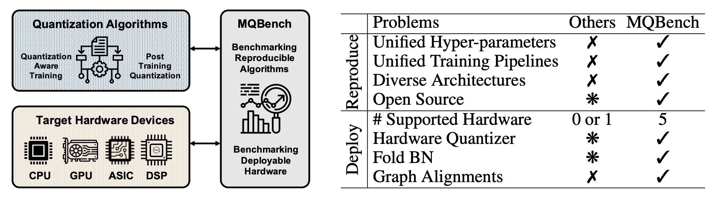

# Awesome Model Quantization 

This repo collects papers, docs, codes about model quantization for anyone who wants to do research on it. We are continuously improving the project. Welcome to PR the works (papers, repositories) that are missed by the repo. Special thanks to [Xingyu Zheng](https://github.com/Xingyu-Zheng), [Yifu Ding](https://yifu-ding.github.io/#/), [Xudong Ma](https://github.com/Macaronlin), [Yuxuan Wen](https://github.com/ChrisLeff), and all researchers who have contributed to this project!

## Table of Contents

- [Efficient AIGC Repo](#Efficient_AIGC_Repo)
- [Benchmark](#benchmark)
  - [BiBench](#bibench)
  - [MQBench](#mqbench)
- [Survey\_Papers](#survey_papers)
  - [Survey\_of\_Binarization](#survey_of_binarization)
  - [Survey\_of\_Quantization](#survey_of_quantization)
- [Papers](#papers)
  - [2024](#2024)
  - [2023](#2023)
  - [2022](#2022)
  - [2021](#2021)
  - [2020](#2020)
  - [2019](#2019)
  - [2018](#2018)
  - [2017](#2017)
  - [2016](#2016)
  - [2015](#2015)

## Efficient_AIGC_Repo

*We **highlight** our newly released awesome open-source project "[**Awesome Efficient AIGC**](https://github.com/htqin/awesome-efficient-aigc)". Specifically, this project focuses on recent methods for compression and acceleration of generative models, such as large language models and diffusion models. Welcome to Star the Repo or PR any work you like!*

https://github.com/htqin/awesome-efficient-aigc 

## Benchmark

### BiBench

The paper **BiBench: Benchmarking and Analyzing Network Binarization** (_ICML 2023_) a rigorously designed benchmark with in-depth analysis for network binarization. For details, please refer to:

**BiBench: Benchmarking and Analyzing Network Binarization** [[Paper](https://arxiv.org/abs/2301.11233)] [[Project](https://github.com/htqin/BiBench)]

[Haotong Qin](https://htqin.github.io/), [Mingyuan Zhang](https://mingyuan-zhang.github.io/), [Yifu Ding](https://yifu-ding.github.io/), Aoyu Li, [Zhongang Cai](https://caizhongang.github.io/), [Ziwei Liu](https://liuziwei7.github.io/), [Fisher Yu](https://www.yf.io/), [Xianglong Liu](https://xlliu-beihang.github.io/).

Bibtex
<pre><code>@inproceedings{qin2023bibench,
  title={BiBench: Benchmarking and Analyzing Network Binarization},
  author={Qin, Haotong and Zhang, Mingyuan and Ding, Yifu and Li, Aoyu and Cai, Zhongang and Liu, Ziwei and Yu, Fisher and Liu, Xianglong},
  booktitle={International Conference on Machine Learning (ICML)},
  year={2023}
}</code></pre>

### MQBench

The paper **MQBench: Towards Reproducible and Deployable Model Quantization Benchmark** (_NeurIPS 2021_) is a benchmark and framework for evluating the quantization algorithms under real world hardware deployments. For details, please refer to:

**MQBench: Towards Reproducible and Deployable Model Quantization Benchmark** [[Paper](https://arxiv.org/abs/2111.03759)] [[Project](http://mqbench.tech/)]

Yuhang Li, Mingzhu Shen, Jian Ma, Yan Ren, Mingxin Zhao, Qi Zhang, [Ruihao Gong](https://xhplus.github.io/), Fengwei Yu, Junjie Yan.

Bibtex
<pre><code>@article{2021MQBench,
  title = "MQBench: Towards Reproducible and Deployable Model Quantization Benchmark",
  author= "Yuhang Li* and Mingzhu Shen* and Jian Ma* and Yan Ren* and Mingxin Zhao* and Qi Zhang* and Ruihao Gong and Fengwei Yu and Junjie Yan",
  journal = "https://openreview.net/forum?id=TUplOmF8DsM",
  year = "2021"
}</code></pre>

## Survey_Papers

### Survey_of_Binarization

Our survey paper **Binary Neural Networks: A Survey** (_Pattern Recognition_) is a comprehensive survey of recent progress in binary neural networks. For details, please refer to:

**Binary Neural Networks: A Survey** [[Paper](https://arxiv.org/abs/2004.03333)] [[Blog](https://mp.weixin.qq.com/s/QGva6fow9tad_daZ_G2p0Q)]

[**Haotong Qin**](https://htqin.github.io/), [Ruihao Gong](https://xhplus.github.io/), [Xianglong Liu\*](http://sites.nlsde.buaa.edu.cn/~xlliu/), Xiao Bai, [Jingkuan Song](https://cfm.uestc.edu.cn/~songjingkuan/), and [Nicu Sebe](https://disi.unitn.it/~sebe/).

Bibtex
<pre><code>@article{Qin:pr20_bnn_survey,
    title = "Binary neural networks: A survey",
    author = "Haotong Qin and Ruihao Gong and Xianglong Liu and Xiao Bai and Jingkuan Song and Nicu Sebe",
    journal = "Pattern Recognition",
    volume = "105",
    pages = "107281",
    year = "2020"
}</code></pre>

### Survey_of_Quantization

The survey paper **A Survey of Quantization Methods for Efficient Neural Network Inference** (ArXiv) is a comprehensive survey of recent progress in quantization. For details, please refer to:

**A Survey of Quantization Methods for Efficient Neural Network Inference** [[Paper](https://arxiv.org/abs/2103.13630)]

Amir Gholami\* , Sehoon Kim\* , Zhen Dong\* , Zhewei Yao\* , Michael W. Mahoney, Kurt Keutzer. (\* Equal contribution)

Bibtex
<pre><code>@misc{gholami2021survey,
      title={A Survey of Quantization Methods for Efficient Neural Network Inference},
      author={Amir Gholami and Sehoon Kim and Zhen Dong and Zhewei Yao and Michael W. Mahoney and Kurt Keutzer},
      year={2021},
      eprint={2103.13630},
      archivePrefix={arXiv},
      primaryClass={cs.CV}
}</code></pre>

## Papers

**Keywords**: **`qnn`**: quantized neural networks | **`bnn`**: binarized neural networks | **`hardware`**: hardware deployment | **`snn`**: spiking neural networks | **`other`**

----

### 2024

- [[arXiv](https://arxiv.org/abs/2404.14047)] How Good Are Low-bit Quantized LLaMA3 Models? An Empirical Study [[code](https://github.com/Macaronlin/LLaMA3-Quantization)] [[HuggingFace](https://huggingface.co/LLMQ)]
- [[arXiv](https://arxiv.org/abs/2402.05445)] Accurate LoRA-Finetuning Quantization of LLMs via Information Retention [[code](https://github.com/htqin/IR-QLoRA)]
- [[arXiv](https://arxiv.org/abs/2402.04291)] BiLLM: Pushing the Limit of Post-Training Quantization for LLMs [[code](https://github.com/Aaronhuang-778/BiLLM)]
- [[arXiv](https://arxiv.org/abs/2404.05662)] BinaryDM: Towards Accurate Binarization of Diffusion Model [[code](https://github.com/Xingyu-Zheng/BinaryDM)]
- [[arXiv](https://arxiv.org/abs/2402.11960)] DB-LLM: Accurate Dual-Binarization for Efficient LLMs
- [[arXiv](https://arxiv.org/abs/2404.05662)] BinaryDM: Towards Accurate Binarization of Diffusion Model [[code](https://github.com/Xingyu-Zheng/BinaryDM)]
- [[arXiv](https://arxiv.org/abs/2309.01945)] OHQ: On-chip Hardware-aware Quantization
- [[arXiv](https://arxiv.org/abs/2311.12359)] Post-Training Quantization with Low-precision Minifloats and Integers on FPGAs [[code](https://github.com/Xilinx/brevitas/tree/dev/src/brevitas_examples/imagenet_classification/ptq)][__`hardware`__]
- [[arXiv](https://arxiv.org/abs/2401.06118)] Extreme Compression of Large Language Models via Additive Quantization
- [[arXiv](https://arxiv.org/abs/2401.07159)] Quantized Side Tuning: Fast and Memory-Efficient Tuning of Quantized Large Language Models
- [[arXiv](https://arxiv.org/abs/2401.14112)] FP6-LLM: Efficiently Serving Large Language Models Through FP6-Centric Algorithm-System Co-Design
- [[arXiv](https://arxiv.org/abs/2401.18079)] KVQuant: Towards 10 Million Context Length LLM Inference with KV Cache Quantization
- [[arXiv](https://arxiv.org/abs/2402.10787)] EdgeQAT: Entropy and Distribution Guided Quantization-Aware Training for the Acceleration of Lightweight LLMs on the Edge [[code](https://github.com/shawnricecake/EdgeQAT)] 
- [[arXiv](https://arxiv.org/abs/2402.10517)] Any-Precision LLM: Low-Cost Deployment of Multiple, Different-Sized LLMs
- [[arXiv](https://arxiv.org/abs/2402.02446)] LQER: Low-Rank Quantization Error Reconstruction for LLMs
- [[arXiv](https://arxiv.org/abs/2402.02750)] KIVI: A Tuning-Free Asymmetric 2bit Quantization for KV Cache [[code](https://github.com/jy-yuan/KIVI)] 
- [[arXiv](https://arxiv.org/abs/2402.04396)] QuIP#: Even Better LLM Quantization with Hadamard Incoherence and Lattice Codebooks [[code](https://github.com/Cornell-RelaxML/quip-sharp)] 
- [[arXiv](https://arxiv.org/abs/2402.04902)] L4Q: Parameter Efficient Quantization-Aware Training on Large Language Models via LoRA-wise LSQ
- [[arXiv](https://arxiv.org/abs/2402.04925)] TP-Aware Dequantization
- [[arXiv](https://arxiv.org/abs/2402.05147)] ApiQ: Finetuning of 2-Bit Quantized Large Language Model
- [[arXiv](https://arxiv.org/abs/2402.10517)] Any-Precision LLM: Low-Cost Deployment of Multiple, Different-Sized LLMs
- [[arXiv](https://arxiv.org/abs/2402.10631)] BitDistiller: Unleashing the Potential of Sub-4-Bit LLMs via Self-Distillation [[code](https://github.com/DD-DuDa/BitDistiller)] 
- [[arXiv](https://arxiv.org/abs/2402.11295)] OneBit: Towards Extremely Low-bit Large Language Models
- [[arXiv](https://arxiv.org/abs/2402.12065)] WKVQuant: Quantising Weight and Key/Value Cache for Large Language Models Gains More
- [[arXiv](https://arxiv.org/abs/2402.15319)] GPTVQ: The Blessing of Dimensionality for LLM Quantization [[code](https://github.com/qualcomm-ai-research/gptvq)] 
- [[DAC](https://arxiv.org/abs/2402.14866)] APTQ: Attention-aware Post-Training Mixed-Precision Quantization for Large Language Models
- [[DAC](https://arxiv.org/abs/2402.16775)] A Comprehensive Evaluation of Quantization Strategies for Large Language Models
- [[arXiv](https://arxiv.org/abs/2402.18096)] No Token Left Behind: Reliable KV Cache Compression via Importance-Aware Mixed Precision Quantization
- [[arXiv](https://arxiv.org/abs/2402.18158)] Evaluating Quantized Large Language Models
- [[arXiv](https://arxiv.org/abs/2402.17985)] FlattenQuant: Breaking Through the Inference Compute-bound for Large Language Models with Per-tensor Quantization
- [[arXiv](https://arxiv.org/abs/2403.01136)] LLM-PQ: Serving LLM on Heterogeneous Clusters with Phase-Aware Partition and Adaptive Quantization
- [[arXiv](https://arxiv.org/abs/2403.01241)] IntactKV: Improving Large Language Model Quantization by Keeping Pivot Tokens Intact
- [[arXiv](https://arxiv.org/abs/2403.01384)] On the Compressibility of Quantized Large Language Models
- [[arXiv](https://arxiv.org/abs/2403.02775)] EasyQuant: An Efficient Data-free Quantization Algorithm for LLMs
- [[arXiv](https://arxiv.org/abs/2403.04643)] QAQ: Quality Adaptive Quantization for LLM KV Cache [[code](https://github.com/ClubieDong/QAQ-KVCacheQuantization)] 
- [[arXiv](https://arxiv.org/abs/2403.05527)] GEAR: An Efficient KV Cache Compression Recipefor Near-Lossless Generative Inference of LLM
- [[arXiv](https://arxiv.org/abs/2403.06408)] What Makes Quantization for Large Language Models Hard? An Empirical Study from the Lens of Perturbation
- [[arXiv](https://arxiv.org/abs/2403.07378)] SVD-LLM: Truncation-aware Singular Value Decomposition for Large Language Model Compression [[code](https://github.com/AIoT-MLSys-Lab/SVD-LLM)] 
- [[ICLR](https://browse.arxiv.org/abs/2402.00858)] AffineQuant: Affine Transformation Quantization for Large Language Models [[code](https://github.com/bytedance/AffineQuant)] 
- [[ICLR Practical ML for Low Resource Settings Workshop](https://arxiv.org/abs/2403.18159)] Oh! We Freeze: Improving Quantized Knowledge Distillation via Signal Propagation Analysis for Large Language Models
- [[arXiv](https://arxiv.org/abs/2403.20137)] Accurate Block Quantization in LLMs with Outliers
- [[arXiv](https://arxiv.org/abs/2404.00456)] QuaRot: Outlier-Free 4-Bit Inference in Rotated LLMs [[code](https://github.com/spcl/QuaRot)] 
- [[arXiv](https://arxiv.org/abs/2404.01892)] Minimize Quantization Output Error with Bias Compensation [[code](https://github.com/GongCheng1919/bias-compensation)] 
- [[arXiv](https://arxiv.org/abs/2404.02837)] Cherry on Top: Parameter Heterogeneity and Quantization in Large Language Models

### 2023

- [[NeurIPS](https://arxiv.org/abs/2305.10299)] Binarized Spectral Compressive Imaging [[code](https://github.com/caiyuanhao1998/BiSCI)]
- [[NeurIPS](https://dev.neurips.cc/virtual/2023/poster/72890)] QuantSR: Accurate Low-bit Quantization for Efficient Image Super-Resolution [[code](https://github.com/htqin/QuantSR)]
- [[NeurIPS](https://neurips.cc/virtual/2023/poster/71287)] BiMatting: Efficient Video Matting via Binarization [[code](https://github.com/htqin/BiMatting)]
- [[NeurIPS](https://nips.cc/virtual/2023/oral/73855)] QLORA: Efficient Finetuning of Quantized LLMs [[code](https://github.com/artidoro/qlora)]
- [[NeurIPS](https://neurips.cc/virtual/2023/poster/70279)] Q-DM: An Efficient Low-bit Quantized Diffusion Model
- [[NeurIPS](https://neurips.cc/virtual/2023/poster/71314)] PTQD: Accurate Post-Training Quantization for Diffusion Models [[code](https://github.com/ziplab/PTQD)]
- [[NeurIPS](https://nips.cc/virtual/2023/poster/72396)] Temporal Dynamic Quantization for Diffusion Models
- [[NeurIPS](https://nips.cc/virtual/2023/poster/72931)] Memory-Efficient Fine-Tuning of Compressed Large Language Models via sub-4-bit Integer Quantization
- [[ICML](https://arxiv.org/pdf/2301.11233.pdf)] BiBench: Benchmarking and Analyzing Network Binarization [**`bnn`**] [[code](https://github.com/htqin/BiBench)]
- [[ICML](https://arxiv.org/abs/2306.00317)] FlexRound: Learnable Rounding based on Element-wise Division for Post-Training Quantization [[code](https://openreview.net/attachment?id=-tYCaP0phY_&name=supplementary_material)]
- [[ICML](https://arxiv.org/abs/2301.12017)] Understanding INT4 Quantization for Transformer Models: Latency Speedup, Composability, and Failure Cases [[code](https://github.com/microsoft/DeepSpeed)]
- [[ICML](https://icml.cc/virtual/2023/28295)] GPT-Zip: Deep Compression of Finetuned Large Language Models
- [[ICML](https://arxiv.org/abs/2307.03738)] QIGen: Generating Efficient Kernels for Quantized Inference on Large Language Models [[code](https://github.com/IST-DASLab/QIGen)]
- [[ICML](https://icml.cc/virtual/2023/poster/23915)] The case for 4-bit precision: k-bit Inference Scaling Laws
- [[TPAMI](https://ieeexplore.ieee.org/abstract/document/9735379)] Optimization-Based Post-Training Quantization With Bit-Split and Stitching
- [[TPAMI](https://ieeexplore.ieee.org/abstract/document/10122994)] Single-path Bit Sharing for Automatic Loss-aware Model Compression
- [[ICCV](https://openaccess.thecvf.com/content/ICCV2023/papers/Shang_Causal-DFQ_Causality_Guided_Data-Free_Network_Quantization_ICCV_2023_paper.pdf)] Causal-DFQ: Causality Guided Data-free Network Quantization [[code](https://github.com/42Shawn/Causal-DFQ)]
- [[ICCV](https://openaccess.thecvf.com/content/ICCV2023/html/Wu_Estimator_Meets_Equilibrium_Perspective_A_Rectified_Straight_Through_Estimator_for_ICCV_2023_paper.html)] Estimator Meets Equilibrium Perspective: A Rectified Straight Through Estimator for Binary Neural Networks Training [[code](https://github.com/DravenALG/ReSTE)]
- [[ICCV](https://arxiv.org/abs/2302.04304)] Q-Diffusion: Quantizing Diffusion Models [[code](https://github.com/Xiuyu-Li/q-diffusion)]
- [[ICCV](https://openaccess.thecvf.com/content/ICCV2023/html/Zhang_QD-BEV__Quantization-aware_View-guided_Distillation_for_Multi-view_3D_Object_Detection_ICCV_2023_paper.html)] QD-BEV : Quantization-aware View-guided Distillation for Multi-view 3D Object Detection
- [[CVPR](https://openaccess.thecvf.com/content/CVPR2023/papers/Shang_Post-Training_Quantization_on_Diffusion_Models_CVPR_2023_paper.pdf)] Post-training Quantization on Diffusion Models [[code](https://github.com/42Shawn/PTQ4DM)]
- [[CVPR](https://openaccess.thecvf.com/content/CVPR2023/papers/Xu_Q-DETR_An_Efficient_Low-Bit_Quantized_Detection_Transformer_CVPR_2023_paper.pdf)] Q-DETR: An Efficient Low-Bit Quantized Detection Transformer [[code](https://github.com/SteveTsui/Q-DETR)]
- [[CVPR](https://openaccess.thecvf.com/content/CVPR2023/html/Li_Hard_Sample_Matters_a_Lot_in_Zero-Shot_Quantization_CVPR_2023_paper.html)] Hard Sample Matters a Lot in Zero-Shot Quantization
- [[CVPR](https://openaccess.thecvf.com/content/CVPR2023/papers/Tu_Toward_Accurate_Post-Training_Quantization_for_Image_Super_Resolution_CVPR_2023_paper.pdf)] Toward Accurate Post-Training Quantization for Image Super Resolution
- [[CVPR](https://openaccess.thecvf.com/content/CVPR2023/papers/Koryakovskiy_One-Shot_Model_for_Mixed-Precision_Quantization_CVPR_2023_paper.pdf)] One-Shot Model for Mixed-Precision Quantization
- [[CVPR](https://openaccess.thecvf.com/content/CVPR2023/html/Liu_PD-Quant_Post-Training_Quantization_Based_on_Prediction_Difference_Metric_CVPR_2023_paper.html)] PD-Quant: Post-Training Quantization Based on Prediction Difference Metric [[code](https://github.com/hustvl/PD-Quant)]
- [[CVPR](https://arxiv.org/abs/2303.06869)] Adaptive Data-Free Quantization
- [[CVPR](https://arxiv.org/pdf/2211.16056.pdf)] NoisyQuant: Noisy Bias-Enhanced Post-Training Activation Quantization for Vision Transformers
- [[CVPR](https://openaccess.thecvf.com/content/CVPR2023/papers/Yu_Boost_Vision_Transformer_With_GPU-Friendly_Sparsity_and_Quantization_CVPR_2023_paper.pdf)] Boost Vision Transformer with GPU-Friendly Sparsity and Quantization
- [[CVPR](https://openaccess.thecvf.com/content/CVPR2023/papers/Shin_NIPQ_Noise_Proxy-Based_Integrated_Pseudo-Quantization_CVPR_2023_paper.pdf)] NIPQ: Noise proxy-based Integrated Pseudo-Quantization
- [[CVPR](https://openaccess.thecvf.com/content/CVPR2023/papers/Lin_Bit-Shrinking_Limiting_Instantaneous_Sharpness_for_Improving_Post-Training_Quantization_CVPR_2023_paper.pdf)] Bit-shrinking: Limiting Instantaneous Sharpness for Improving Post-training Quantization
- [[CVPR](https://arxiv.org/pdf/2303.11906.pdf)] Solving Oscillation Problem in Post-Training Quantization Through a Theoretical Perspective
- [[CVPR](https://ipl.dgist.ac.kr/ABCD_cvpr23.pdf)] ABCD : Arbitrary Bitwise Coefficient for De-quantization
- [[CVPR](https://arxiv.org/abs/2212.04780)] GENIE: Show Me the Data for Quantization
- [[CVPR](https://arxiv.org/abs/2303.06424)] Regularized Vector Quantization for Tokenized Image Synthesis
- [[CVPRW](https://arxiv.org/abs/2306.16678)] BinaryViT: Pushing Binary Vision Transformers Towards Convolutional Models. [**`bnn`**] [[code](https://github.com/phuoc-hoan-le/binaryvit)]
- [[ICLR](https://arxiv.org/abs/2210.17323)] GPTQ: Accurate Post-Training Quantization for Generative Pre-trained Transformers [[code](https://github.com/IST-DASLab/gptq)] [721⭐]
- [[ICLR](https://openreview.net/forum?id=3itjR9QxFw)] Analog Bits: Generating Discrete Data using Diffusion Models with Self-Conditioning 
- [[ACL](https://arxiv.org/abs/2306.00014)] PreQuant: A Task-agnostic Quantization Approach for Pre-trained Language Models
- [[ACL](https://aclanthology.org/2023.findings-acl.15/)] Boost Transformer-based Language Models with GPU-Friendly Sparsity and Quantization
- [[EMNLP](https://arxiv.org/abs/2310.05079)] Revisiting Block-based Quantisation: What is Important for Sub-8-bit LLM Inference?
- [[EMNLP](https://arxiv.org/abs/2310.13315)] Zero-Shot Sharpness-Aware Quantization for Pre-trained Language Models
- [[EMNLP](https://arxiv.org/abs/2310.16836)] LLM-FP4: 4-Bit Floating-Point Quantized Transformers [[code](https://github.com/nbasyl/LLM-FP4)]
- [[EMNLP](https://arxiv.org/abs/2310.11237)] Watermarking LLMs with Weight Quantization [[code](https://github.com/Twilight92z/Quantize-Watermark)]
- [[EMNLP](https://arxiv.org/abs/2304.09145)] Outlier Suppression+: Accurate quantization of large language models by equivalent and optimal shifting and scaling
- [[TNNLS](https://ieeexplore.ieee.org/document/10049753/)] BiFSMNv2: Pushing Binary Neural Networks for Keyword Spotting to Real-Network Performance. [__`bnn`__] [[code](https://github.com/htqin/BiFSMNv2)]
- [[TNNLS](https://ieeexplore.ieee.org/abstract/document/10227741)] Quantization via Distillation and Contrastive Learning.
- [[HPCA](https://ieeexplore.ieee.org/document/9773213/)] Enabling High-Quality Uncertainty Quantification in a PIM Designed for Bayesian Neural Network
- [[TIP](https://ieeexplore.ieee.org/abstract/document/10107717)] MBFQuant: A Multiplier-Bitwidth-Fixed, Mixed-Precision Quantization Method for Mobile CNN-Based Applications
- [[TCSVT](https://ieeexplore.ieee.org/abstract/document/10132082)] Generative Data Free Model Quantization with Knowledge Matching for Classification [[code](https://github.com/ZSHsh98/KMDFQ)]
- [[WACV](https://openaccess.thecvf.com/content/WACV2023/html/do_Nascimento_Hyperblock_Floating_Point_Generalised_Quantization_Scheme_for_Gradient_and_Inference_WACV_2023_paper.html)] Hyperblock Floating Point: Generalised Quantization Scheme for Gradient and Inference Computation
- [[WACV](https://openaccess.thecvf.com/content/WACV2023/html/Yvinec_SPIQ_Data-Free_Per-Channel_Static_Input_Quantization_WACV_2023_paper.html)] SPIQ: Data-Free Per-Channel Static Input Quantization
- [[WACV](https://openaccess.thecvf.com/content/WACV2023/papers/Pham_Collaborative_Multi-Teacher_Knowledge_Distillation_for_Learning_Low_Bit-Width_Deep_Neural_WACV_2023_paper.pdf)] Collaborative Multi-Teacher Knowledge Distillation for Learning Low Bit-width Deep Neural Networks.
- [[PR](https://www.sciencedirect.com/science/article/pii/S0031320323001632)] Bayesian asymmetric quantized neural networks.
- [[PR](https://www.sciencedirect.com/science/article/pii/S0031320323004788)] Data-free quantization via mixed-precision compensation without fine-tuning.
- [[NN](https://www.sciencedirect.com/science/article/pii/S0893608023004008)] Long-range zero-shot generative deep network quantization.
- [[Cognitive Neurodynamics](https://link.springer.com/article/10.1007/s11571-022-09927-7)] Pruning and quantization algorithm with applications in memristor-based convolutional neural network.
- [[MMM](https://link.springer.com/chapter/10.1007/978-3-031-27077-2_8)] Binary Neural Network for Video Action Recognition. [__`bnn`__]
- [[ISCA](https://dl.acm.org/doi/abs/10.1145/3579371.3589038)] OliVe: Accelerating Large Language Models via Hardware-friendly Outlier-Victim Pair Quantization
- [[arXiv](https://arxiv.org/pdf/2211.10438.pdf)] SmoothQuant: Accurate and Efficient Post-Training Quantization for Large Language Models. [[code](https://github.com/mit-han-lab/smoothquant)] [387⭐]
- [[arXiv](https://arxiv.org/pdf/2208.00164.pdf)] Distilled Low Rank Neural Radiance Field with Quantization for Light Field Compression
- [[arXiv](https://arxiv.org/pdf/2201.11113.pdf)] Post-training Quantization for Neural Networks with Provable Guarantees.
- [[arXiv](https://arxiv.org/abs/2303.08302)] ZeroQuant-V2: Exploring Post-training Quantization in LLMs from Comprehensive Study to Low Rank Compensation.
- [[arXiv](https://arxiv.org/abs/2303.12557)] Q-HyViT: Post-Training Quantization for Hybrid Vision Transformer with Bridge Block Reconstruction.
- [[arXiv](https://arxiv.org/abs/2303.12270)] EBSR: Enhanced Binary Neural Network for Image Super-Resolution. [__`bnn`__]
- [[arXiv](https://arxiv.org/abs/2303.15493)] Binarizing Sparse Convolutional Networks for Efficient Point Cloud Analysis. [__`bnn`__]
- [[arXiv](https://arxiv.org/abs/2304.01089)] RPTQ: Reorder-based Post-training Quantization for Large Language Models.  [[code](https://github.com/hahnyuan/RPTQ4LLM)]
- [[arXiv](https://arxiv.org/abs/2304.09785)] Improving Post-Training Quantization on Object Detection with Task Loss-Guided Lp Metric. [__`ptq`__]
- [[arXiv](https://arxiv.org/abs/2305.12356)] Integer or Floating Point? New Outlooks for Low-Bit Quantization on Large Language Models. 
- [[arXiv](https://arxiv.org/abs/2206.09557)] LUT-GEMM: Quantized Matrix Multiplication based on LUTs for Efficient Inference in Large-Scale Generative Language Models
- [[arXiv](https://arxiv.org/abs/2306.03078)] SpQR: A Sparse-Quantized Representation for Near-Lossless LLM Weight Compression [[code](https://github.com/Vahe1994/SpQR)]
- [[arXiv](https://arxiv.org/abs/2302.02390)] Quantized Distributed Training of Large Models with Convergence Guarantees
- [[arXiv](https://arxiv.org/abs/2305.17888)] LLM-QAT: Data-Free Quantization Aware Training for Large Language Models
- [[arXiv](https://arxiv.org/abs/2306.00978)] AWQ: Activation-aware Weight Quantization for LLM Compression and Acceleration [[code](https://github.com/mit-han-lab/llm-awq)]
- [[arXiv](https://arxiv.org/abs/2306.11987)] Training Transformers with 4-bit Integers [[code](https://github.com/xijiu9/Train_Transformers_with_INT4)]
- [[arXiv](https://arxiv.org/abs/2305.11186)] Compress, Then Prompt: Improving Accuracy-Efficiency Trade-off of LLM Inference with Transferable Prompt
- [[arXiv](https://arxiv.org/abs/2305.18723)] Towards Accurate Data-free Quantization for Diffusion Models
- [[arXiv](https://arxiv.org/abs/2306.08162)] INT2.1: Towards Fine-Tunable Quantized Large Language Models with Error Correction through Low-Rank Adaptation
- [[arXiv](https://arxiv.org/abs/2306.07629)] SqueezeLLM: Dense-and-Sparse Quantization [[code](https://github.com/SqueezeAILab/SqueezeLLM)]
- [[arXiv](https://arxiv.org/abs/2306.12929)] Quantizable Transformers: Removing Outliers by Helping Attention Heads Do Nothing
- [[arXiv](https://arxiv.org/abs/2306.13515)] Binary domain generalization for sparsifying binary neural networks.  [__`bnn`__]
- [[arXiv](https://arxiv.org/abs/2307.03712)] INT-FP-QSim: Mixed Precision and Formats For Large Language Models and Vision Transformers [[code](https://github.com/lightmatter-ai/INT-FP-QSim)]
- [[arXiv](https://arxiv.org/abs/2307.09782)] ZeroQuant-FP: A Leap Forward in LLMs Post-Training W4A8 Quantization Using Floating-Point Formats.
- [[arXiv](https://arxiv.org/abs/2306.02272)] OWQ: Lessons learned from activation outliers for weight quantization in large language models. 
- [[arXiv](https://arxiv.org/abs/2307.08072)] Do Emergent Abilities Exist in Quantized Large Language Models: An Empirical Study
- [[arXiv](https://arxiv.org/abs/2307.13304)] QuIP: 2-Bit Quantization of Large Language Models With Guarantees. [[code](https://github.com/jerry-chee/QuIP)]
- [[arXiv](https://arxiv.org/abs/2308.05600)] NUPES : Non-Uniform Post-Training Quantization via Power Exponent Search
- [[arXiv](https://arxiv.org/abs/2308.06744)] Token-Scaled Logit Distillation for Ternary Weight Generative Language Models
- [[arXiv](https://arxiv.org/abs/2308.07662)] Gradient-Based Post-Training Quantization: Challenging the Status Quo
- [[arXiv](https://arxiv.org/abs/2308.09723)] FineQuant: Unlocking Efficiency with Fine-Grained Weight-Only Quantization for LLMs
- [[arXiv](https://arxiv.org/abs/2308.13137)] OmniQuant: Omnidirectionally Calibrated Quantization for Large Language Models. [[code](https://github.com/OpenGVLab/OmniQuant)]
- [[arXiv](https://arxiv.org/abs/2308.14903)] MEMORY-VQ: Compression for Tractable Internet-Scale Memory
- [[arXiv](https://arxiv.org/abs/2308.15987)] FPTQ: Fine-grained Post-Training Quantization for Large Language Models
- [[arXiv](https://arxiv.org/abs/2309.00964)] eDKM: An Efficient and Accurate Train-time Weight Clustering for Large Language Models
- [[arXiv](https://arxiv.org/abs/2309.01885)] QuantEase: Optimization-based Quantization for Language Models - An Efficient and Intuitive Algorithm
- [[arXiv](https://arxiv.org/abs/2309.02784)] Norm Tweaking: High-performance Low-bit Quantization of Large Language Models
- [[arXiv](https://arxiv.org/abs/2309.05210)] Understanding the Impact of Post-Training Quantization on Large Language Models
- [[arXiv](https://arxiv.org/abs/2309.05516)] Optimize Weight Rounding via Signed Gradient Descent for the Quantization of LLMs. [[code](https://github.com/intel/neural-compressor)]
- [[arXiv](https://arxiv.org/abs/2310.00034)] PB-LLM: Partially Binarized Large Language Models. [[code](https://github.com/hahnyuan/PB-LLM)]
- [[arXiv](https://arxiv.org/abs/2308.10187)] Spiking-Diffusion: Vector Quantized Discrete Diffusion Model with Spiking Neural Networks [[code](https://github.com/Arktis2022/Spiking-Diffusion)] [__`snn`__] 
- [[arXiv](https://arxiv.org/abs/2309.01885)] QuantEase: Optimization-based Quantization for Language Models - An Efficient and Intuitive Algorithm
- [[arXiv](https://arxiv.org/abs/2309.14592)] Efficient Post-training Quantization with FP8 Formats [[code](https://github.com/intel/neural-compressor)]
- [[arXiv](https://arxiv.org/abs/2309.14717)] QA-LoRA: Quantization-Aware Low-Rank Adaptation of Large Language Models [[code](https://github.com/yuhuixu1993/qa-lora)]
- [[arXiv](https://arxiv.org/abs/2309.15531)] Rethinking Channel Dimensions to Isolate Outliers for Low-bit Weight Quantization of Large Language Models
- [[arXiv](https://arxiv.org/abs/2309.16119)] ModuLoRA: Finetuning 3-Bit LLMs on Consumer GPUs by Integrating with Modular Quantizers
- [[arXiv](https://arxiv.org/abs/2310.07147)] QFT: Quantized Full-parameter Tuning of LLMs with Affordable Resources
- [[arXiv](https://arxiv.org/abs/2310.08041)] QLLM: Accurate and Efficient Low-Bitwidth Quantization for Large Language Models
- [[arXiv](https://arxiv.org/abs/2310.08659)] LoftQ: LoRA-Fine-Tuning-Aware Quantization for Large Language Models [[code](https://github.com/yxli2123/LoftQ)]
- [[arXiv](https://arxiv.org/abs/2310.10944)] TEQ: Trainable Equivalent Transformation for Quantization of LLMs [[code](https://github.com/intel/neural-compressor)]
- [[arXiv](https://arxiv.org/abs/2310.11453)] BitNet: Scaling 1-bit Transformers for Large Language Models [[code](https://github.com/kyegomez/BitNet)]
- [[arXiv](https://arxiv.org/abs/2310.18313)] FP8-LM: Training FP8 Large Language Models [[code](https://github.com/Azure/MS-AMP)]
- [[arXiv](https://arxiv.org/abs/2310.19102)] Atom: Low-bit Quantization for Efficient and Accurate LLM Serving [[code](https://github.com/efeslab/Atom)]
- [[arXiv](https://arxiv.org/abs/2311.01305)] AWEQ: Post-Training Quantization with Activation-Weight Equalization for Large Language Models
- [[arXiv](https://arxiv.org/abs/2311.01792)] AFPQ: Asymmetric Floating Point Quantization for LLMs [[code](https://github.com/zhangsichengsjtu/AFPQ)]
- [[arXiv](https://arxiv.org/abs/2311.18159)] Compact3D: Compressing Gaussian Splat Radiance Field Models with Vector Quantization [[Compact3D](https://github.com/UCDvision/compact3d)]

### 2022

- [[ECCV](https://www.ecva.net/papers/eccv_2022/papers_ECCV/papers/136710416.pdf)] Weight Fixing Networks.  [__`qnn`__] [[code]](https://github.com/subiawaud/Weight_Fix_Networks)
- [[ECCV](https://link.springer.com/chapter/10.1007/978-3-031-20071-7_37)] Neuromorphic Data Augmentation for Training Spiking Neural Networks. [__`snn`__] [[code]](https://github.com/Intelligent-Computing-Lab-Yale/NDA_SNN)
- [[IJCV](https://arxiv.org/abs/2109.12338)] Distribution-sensitive Information Retention for Accurate Binary Neural Network. [__`bnn`__]
- [[ICML](https://proceedings.mlr.press/v162/huang22h.html)] SDQ: Stochastic Differentiable Quantization with Mixed Precision [**`qnn`**]
- [[ICML](https://proceedings.mlr.press/v162/dong22a.html)] Finding the Task-Optimal Low-Bit Sub-Distribution in Deep Neural Networks [**`qnn`**] [**`hardware`**]
- [[ICML](https://proceedings.mlr.press/v162/liu22v.html)] GACT: Activation Compressed Training for Generic Network Architectures [**`qnn`**]
- [[ICLR](https://openreview.net/forum?id=5xEgrl_5FAJ)] BiBERT: Accurate Fully Binarized BERT. [**`bnn`**][code](https://github.com/htqin/BiBERT)]
- [[CVPR](https://openaccess.thecvf.com/content/CVPR2022/html/Guo_RecDis-SNN_Rectifying_Membrane_Potential_Distribution_for_Directly_Training_Spiking_Neural_CVPR_2022_paper.html)] RecDis-SNN: Rectifying Membrane Potential Distribution for Directly Training Spiking Neural Networks. [**`snn`**]
- [[CVPR](https://arxiv.org/abs/2203.17008)] It's All In the Teacher: Zero-Shot Quantization Brought Closer to the Teacher. [**`qnn`**] [[code](https://github.com/iamkanghyunchoi/ait)] 
- [[CVPR](https://arxiv.org/abs/2111.14826)] Nonuniform-to-Uniform Quantization: Towards Accurate Quantization via Generalized Straight-Through Estimation. [**`qnn`**] [[code](https://github.com/liuzechun/Nonuniform-to-Uniform-Quantization)] [59⭐]
- [[CVPR](https://openaccess.thecvf.com/content/CVPR2022/papers/Wang_Learnable_Lookup_Table_for_Neural_Network_Quantization_CVPR_2022_paper.pdf)] Learnable Lookup Table for Neural Network Quantization. [__`qnn`__]
- [[CVPR](https://openaccess.thecvf.com/content/CVPR2022/papers/Jeon_Mr.BiQ_Post-Training_Non-Uniform_Quantization_Based_on_Minimizing_the_Reconstruction_Error_CVPR_2022_paper.pdf)] Mr.BiQ: Post-Training Non-Uniform Quantization based on Minimizing the Reconstruction Error. [__`qnn`__]
- [[CVPR](https://arxiv.org/abs/2111.14826)] Nonuniform-to-Uniform Quantization: Towards Accurate Quantization via Generalized Straight-Through Estimation. [__`qnn`__]
- [[CVPR](https://openaccess.thecvf.com/content/CVPR2022/papers/Chikin_Data-Free_Network_Compression_via_Parametric_Non-Uniform_Mixed_Precision_Quantization_CVPR_2022_paper.pdf)] Data-Free Network Compression via Parametric Non-uniform Mixed Precision Quantization. [__`qnn`__]
- [[CVPR](https://openaccess.thecvf.com/content/CVPR2022/papers/Liu_Instance-Aware_Dynamic_Neural_Network_Quantization_CVPR_2022_paper.pdf)] Instance-Aware Dynamic Neural Network Quantization. [__`qnn`__]
- [[NeurIPS](https://nips.cc/Conferences/2022/Schedule?showEvent=55032)] BiT: Robustly Binarized Multi-distilled Transformer. [**`bnn`**] [[code](https://github.com/facebookresearch/bit)] [42⭐]
- [[NeurIPS](https://nips.cc/Conferences/2022/Schedule?showEvent=54389)] Leveraging Inter-Layer Dependency for Post -Training Quantization. [__`qnn`__]
- [[NeurIPS](https://nips.cc/Conferences/2022/Schedule?showEvent=53476)] Theoretically Better and Numerically Faster Distributed Optimization with Smoothness-Aware Quantization Techniques. [__`qnn`__]
- [[NeurIPS](https://nips.cc/Conferences/2022/Schedule?showEvent=54104)] Entropy-Driven Mixed-Precision Quantization for Deep Network Design. [__`qnn`__]
- [[NeurIPS](https://nips.cc/Conferences/2022/Schedule?showEvent=54812)] Redistribution of Weights and Activations for AdderNet Quantization. [__`qnn`__]
- [[NeurIPS](https://nips.cc/Conferences/2022/Schedule?showEvent=53073)] FP8 Quantization: The Power of the Exponent. [__`qnn`__]
- [[NeurIPS](https://nips.cc/Conferences/2022/Schedule?showEvent=53407)] Towards Efficient Post-training Quantization of Pre-trained Language Models. [__`qnn`__]
- [[NeurIPS](https://nips.cc/Conferences/2022/Schedule?showEvent=53412)] Optimal Brain Compression: A Framework for Accurate Post-Training Quantization and Pruning. [__`qnn`__] [**`hardware`**]
- [[NeurIPS](https://nips.cc/Conferences/2022/Schedule?showEvent=54407)] ZeroQuant: Efficient and Affordable Post-Training Quantization for Large-Scale Transformers. [__`qnn`__]
- [[NeurIPS](https://nips.cc/Conferences/2022/Schedule?showEvent=55162)] ClimbQ: Class Imbalanced Quantization Enabling Robustness on Efficient Inferences. [__`qnn`__]
- [[NeurIPS](https://openreview.net/forum?id=fU-m9kQe0ke)] Q-ViT: Accurate and Fully Quantized Low-bit Vision Transformer. [__`qnn`__]
- [[NeurIPS](https://proceedings.neurips.cc/paper_files/paper/2022/hash/20f94998511f25bb6378cae0e098bc46-Abstract-Conference.html)] BiMLP: Compact Binary Architectures for Vision Multi-Layer Perceptrons. [**`bnn`**] [[code](https://gitee.com/mindspore/models/tree/master/research/cv/BiMLP)]
- [[ECCV](https://www.ecva.net/papers/eccv_2022/papers_ECCV/papers/136710657.pdf)] Non-Uniform Step Size Quantization for Accurate Post-Training Quantization. [__`qnn`__]
- [[ECCV](https://www.ecva.net/papers/eccv_2022/papers_ECCV/papers/136720190.pdf)] PTQ4ViT: Post-Training Quantization for Vision Transformers with Twin Uniform Quantization. [__`qnn`__]
- [[ECCV](https://www.ecva.net/papers/eccv_2022/papers_ECCV/papers/136710726.pdf)] Towards Accurate Network Quantization with Equivalent Smooth Regularizer. [__`qnn`__]
- [[ECCV](https://www.ecva.net/papers/eccv_2022/papers_ECCV/papers/136720017.pdf)] BASQ: Branch-wise Activation-clipping Search Quantization for Sub-4-bit Neural Networks. [__`qnn`__]
- [[ECCV](https://www.ecva.net/papers/eccv_2022/papers_ECCV/papers/136720156.pdf)] RDO-Q: Extremely Fine-Grained Channel-Wise Quantization via Rate-Distortion Optimization. [__`qnn`__]
- [[ECCV](https://arxiv.org/abs/2203.08368)] Mixed-Precision Neural Network Quantization via Learned Layer-Wise Importance. [__`qnn`__] [[Code](https://github.com/1hunters/LIMPQ)]
- [[ECCV](https://www.ecva.net/papers/eccv_2022/papers_ECCV/papers/136710207.pdf)] Symmetry Regularization and Saturating Nonlinearity for Robust Quantization. [__`qnn`__]
- [[ECCV](https://www.ecva.net/papers/eccv_2022/papers_ECCV/papers/136710154.pdf)] Patch Similarity Aware Data-Free Quantization for Vision Transformers. [__`qnn`__]
- [[IJCAI](https://arxiv.org/abs/2202.06483)] BiFSMN: Binary Neural Network for Keyword Spotting. [__`bnn`__] [[code](https://github.com/htqin/BiFSMN)]
- [[IJCAI](https://www.ijcai.org/proceedings/2022/219)] RAPQ: Rescuing Accuracy for Power-of-Two Low-bit Post-training Quantization. [__`qnn`__]
- [[IJCAI](https://www.ijcai.org/proceedings/2022/504)] MultiQuant: Training Once for Multi-bit Quantization of Neural Networks. [__`qnn`__]
- [[IJCAI](https://arxiv.org/abs/2111.13824)] FQ-ViT: Post-Training Quantization for Fully Quantized Vision Transformer. [__`qnn`__] [[code](https://github.com/megvii-research/FQ-ViT)] [71:star:]
- [[ICLR](https://openreview.net/forum?id=_CfpJazzXT2)] F8Net: Fixed-Point 8-bit Only Multiplication for Network Quantization. [**`qnn`**]
- [[ICLR](https://openreview.net/forum?id=shpkpVXzo3h)] 8-bit Optimizers via Block-wise Quantization. [**`qnn`**]
- [[ICLR](https://openreview.net/forum?id=3HJOA-1hb0e)] Toward Efficient Low-Precision Training: Data Format Optimization and Hysteresis Quantization. [**`qnn`**]
- [[ICLR](https://openreview.net/forum?id=kF9DZQQrU0w)] Information Bottleneck: Exact Analysis of (Quantized) Neural Networks. [**`qnn`**]
- [[ICLR](https://openreview.net/forum?id=ySQH0oDyp7)] QDrop: Randomly Dropping Quantization for Extremely Low-bit Post-Training Quantization. [**`qnn`**]
- [[ICLR](https://openreview.net/forum?id=JXhROKNZzOc)] SQuant: On-the-Fly Data-Free Quantization via Diagonal Hessian Approximation. [**`qnn`**][code](https://github.com/clevercool/SQuant)]
- [[ICLR](https://openreview.net/forum?id=ySQH0oDyp7)] Optimal ANN-SNN Conversion for High-accuracy and Ultra-low-latency Spiking Neural Networks. [**`snn`**]
- [[ICLR](https://openreview.net/forum?id=7udZAsEzd60)] VC dimension of partially quantized neural networks in the overparametrized regime. [**`qnn`**]
- [[arXiv](https://arxiv.org/pdf/2201.07703.pdf)] Q-ViT: Fully Differentiable Quantization for Vision Transformer [__`qnn`__]
- [[arXiv](https://arxiv.org/pdf/2211.10438.pdf)] SmoothQuant: Accurate and Efficient Post-Training Quantization for Large Language Models [__`qnn`__] [[code](https://github.com/mit-han-lab/smoothquant)] [150:star:]
- [[arXiv](https://arxiv.org/pdf/2202.05048.pdf)] Quantune: Post-training Quantization of Convolutional Neural Networks using Extreme Gradient Boosting for Fast Deployment [__`qnn`__]
- [[TGARS](https://ieeexplore.ieee.org/abstract/document/9362309)] Accelerating Convolutional Neural Network-Based Hyperspectral Image Classification by Step Activation Quantization [__`qnn`__]
- [[arXiv](https://arxiv.org/pdf/2201.08442)] Neural network quantization with ai model efficiency toolkit (aimet).
- [[IJNS](https://arxiv.org/pdf/2209.15317.pdf)] Convolutional Neural Networks Quantization with Attention.
- [[ACM Trans. Des. Autom. Electron. Syst.](https://web.archive.org/web/20220722092230id_/https://dl.acm.org/doi/pdf/10.1145/3549535)] Structured Dynamic Precision for Deep Neural Networks uantization.
- [[MICRO](https://ieeexplore.ieee.org/abstract/document/9923832)] ANT: Exploiting Adaptive Numerical Data Type for Low-bit Deep Neural Network Quantization.
- [[ESE](https://link.springer.com/article/10.1007/s10664-022-10202-w)] DiverGet: a Search-Based Software Testing approach for Deep Neural Network Quantization assessment.
- [[TODAES](https://dl.acm.org/doi/10.1145/3498328)] Dynamic Quantization Range Control for Analog-in-Memory Neural Networks Acceleration.
- [[CVPR](https://ieeexplore.ieee.org/document/9879477/)] BppAttack: Stealthy and Efficient Trojan Attacks against Deep Neural Networks via Image Quantization and Contrastive Adversarial Learning. [[torch](https://github.com/RU-System-Software-and-Security/BppAttack)]
- [[IEEE Internet of Things Journal](https://ieeexplore.ieee.org/abstract/document/9915794)] FedQNN: A Computation–Communication-Efficient Federated Learning Framework for IoT With Low-Bitwidth Neural Network Quantization.
- [[FPGA](https://dl.acm.org/doi/abs/10.1145/3490422.3502364)] FILM-QNN: Efficient FPGA Acceleration of Deep Neural Networks with Intra-Layer, Mixed-Precision Quantization.
- [[Neural Networks](https://www.sciencedirect.com/science/article/pii/S0893608022003598)] Quantization-aware training for low precision photonic neural networks.
- [[ICCRD](https://ieeexplore.ieee.org/abstract/document/9730411/authors)] Post Training Quantization after Neural Network.
- [[Electronics](https://www.mdpi.com/2079-9292/11/6/945)] A Survey on Efficient Convolutional Neural Networks and Hardware Acceleration.
- [[Applied Soft Computing](https://www.sciencedirect.com/science/article/pii/S1568494622005038)] A neural network compression method based on knowledge-distillation and parameter quantization for the bearing fault diagnosis.
- [[CVPR](https://openaccess.thecvf.com/content/CVPR2022/html/Zhong_IntraQ_Learning_Synthetic_Images_With_Intra-Class_Heterogeneity_for_Zero-Shot_Network_CVPR_2022_paper.html)] IntraQ: Learning Synthetic Images With Intra-Class Heterogeneity for Zero-Shot Network Quantization. [[torch](https://github.com/zysxmu/IntraQ)]
- [[Neurocomputing](https://www.sciencedirect.com/science/article/pii/S0925231222008293)] EPQuant: A Graph Neural Network compression approach based on product quantization.
- [[tinyML Research Symposium](https://arxiv.org/pdf/2203.05025.pdf)] Power-of-Two Quantization for Low Bitwidth and Hardware Compliant Neural Networks.
- [[arXiv](http://arxiv.org/abs/2206.15408)] Sub-8-Bit Quantization Aware Training for 8-Bit Neural Network Accelerator with On-Device Speech Recognition.
- [[Ocean Engineering](https://www.sciencedirect.com/science/article/pii/S0029801822017887)] Neural network based adaptive sliding mode tracking control of autonomous surface vehicles with input quantization and saturation.
- [[CVPR](https://openaccess.thecvf.com/content/CVPR2022W/ECV/papers/Jiang_A_Low_Memory_Footprint_Quantized_Neural_Network_for_Depth_Completion_CVPRW_2022_paper.pdf)] A Low Memory Footprint Quantized Neural Network for Depth Completion of Very Sparse Time-of-Flight Depth Maps.
- [[PPoPP](https://dl.acm.org/doi/abs/10.1145/3503221.3508408)] QGTC: accelerating quantized graph neural networks via GPU tensor core.
- [[TCSVT](https://ieeexplore.ieee.org/abstract/document/9849674)] An Efficient Implementation of Convolutional Neural Network With CLIP-Q Quantization on FPGA.
- [[EANN](https://link.springer.com/chapter/10.1007/978-3-031-08223-8_35)] A Robust, Quantization-Aware Training Method for Photonic Neural Networks.
- [[arXiv](https://arxiv.org/pdf/2206.07527.pdf)] QONNX: Representing Arbitrary-Precision Quantized Neural Networks.
- [[arXiv](https://arxiv.org/pdf/2206.07741.pdf)] Edge Inference with Fully Differentiable Quantized Mixed Precision Neural Networks.
- [[ITSM](https://ieeexplore.ieee.org/abstract/document/9827546)] Edge–Artificial Intelligence-Powered Parking Surveillance With Quantized Neural Networks.
- [[CVPR](https://openaccess.thecvf.com/content/CVPR2022/papers/Jeon_Mr.BiQ_Post-Training_Non-Uniform_Quantization_Based_on_Minimizing_the_Reconstruction_Error_CVPR_2022_paper.pdf)] Mr.BiQ: Post-Training Non-Uniform Quantization based on Minimizing the Reconstruction Error.
- [[Intelligent Automation & Soft Computing](https://web.p.ebscohost.com/abstract?direct=true&profile=ehost&scope=site&authtype=crawler&jrnl=10798587&AN=155230773&h=buFz%2f8gWWhfyGU%2btyHURhybWlmqZvGCIyITNuefG%2bIwBHoSqNwo4CVrCT7hsuZbtZ%2brDTVnLfGgNR6EX8e6%2fGg%3d%3d&crl=c&resultNs=AdminWebAuth&resultLocal=ErrCrlNotAuth&crlhashurl=login.aspx%3fdirect%3dtrue%26profile%3dehost%26scope%3dsite%26authtype%3dcrawler%26jrnl%3d10798587%26AN%3d155230773)] A Resource-Efficient Convolutional Neural Network Accelerator Using Fine-Grained Logarithmic Quantization.
- [[ICML](https://proceedings.mlr.press/v162/nagel22a/nagel22a.pdf)] Overcoming Oscillations in Quantization-Aware Training. [[torch](https://github.com/qualcomm-ai-research/oscillations-qat)]
- [[CCF Transactions on High Performance Computing](https://link.springer.com/article/10.1007/s42514-022-00121-z)] An efficient segmented quantization for graph neural networks.
- [[CVPR](https://openaccess.thecvf.com/content/CVPR2022W/ECV/papers/van_Baalen_Simulated_Quantization_Real_Power_Savings_CVPRW_2022_paper.pdf)] Simulated Quantization, Real Power Savings.
- [[LNAI](https://link.springer.com/chapter/10.1007/978-3-031-04083-2_14)] ECQ$^x$: Explainability-Driven Quantization for Low-Bit and Sparse DNNs.
- [[TCCN](https://ieeexplore.ieee.org/abstract/document/9703679)] Low-Bitwidth Convolutional Neural Networks for Wireless Interference Identification.
- [[ASE](https://dl.acm.org/doi/abs/10.1145/3551349.3556916)] QVIP: An ILP-based Formal Verification Approach for Quantized Neural Networks.
- [[ICPR](https://ieeexplore.ieee.org/abstract/document/9956237)] Layer-Wise Data-Free CNN Compression.
- [[IJCNN](https://ieeexplore.ieee.org/abstract/document/9892671)] Accuracy Evaluation of Transposed Convolution-Based Quantized Neural Networks.
- [[NeurIPS]](https://arxiv.org/abs/2209.13325) Outlier Suppression: Pushing the Limit of Low-bit Transformer Language Models. [[code](https://github.com/wimh966/outlier_suppression)]
- [[ACL](https://aclanthology.org/2022.acl-long.331)] Compression of Generative Pre-trained Language Models via Quantization
- [[NeurIPS](https://arxiv.org/abs/2208.07339)] LLM.int8(): 8-bit Matrix Multiplication for Transformers at Scale

### 2021

- [[ICLR](https://openreview.net/forum?id=9QLRCVysdlO)] BiPointNet: Binary Neural Network for Point Clouds. [**`bnn`**] [[torch](https://github.com/htqin/BiPointNet)]
- [[ICML](http://proceedings.mlr.press/v139/liu21t/liu21t.pdf)] How Do Adam and Training Strategies Help BNNs Optimization?. [**`bnn`**] [[code](https://github.com/liuzechun/AdamBNN)] [48⭐]
- [[ICML](https://proceedings.mlr.press/v139/chen21z.html)] ActNN: Reducing Training Memory Footprint via 2-Bit Activation Compressed Training [**`qnn`**]
- [[ICML](https://proceedings.mlr.press/v139/yao21a.html)] HAWQ-V3: Dyadic Neural Network Quantization. [**`qnn`**]
- [[ICML](https://proceedings.mlr.press/v139/kim21d.html)] I-BERT: Integer-only BERT Quantization. [**`qnn`**]
- [[ICML](https://proceedings.mlr.press/v139/zhang21r.html)] Differentiable Dynamic Quantization with Mixed Precision and Adaptive Resolution. [**`qnn`**]
- [[ICML](https://proceedings.mlr.press/v139/fu21d.html)] Auto-NBA: Efficient and Effective Search Over the Joint Space of Networks, Bitwidths, and Accelerators. [**`qnn`**]
- [[ICCV](https://openaccess.thecvf.com/content/ICCV2021/html/Li_MixMix_All_You_Need_for_Data-Free_Compression_Are_Feature_and_ICCV_2021_paper.html)] MixMix: All You Need for Data-Free Compression Are Feature and Data Mixing.
- [[CVPR](http://openaccess.thecvf.com/content/CVPR2021/html/Shen_S2-BNN_Bridging_the_Gap_Between_Self-Supervised_Real_and_1-Bit_Neural_CVPR_2021_paper.html)] S2-bnn: Bridging the gap between self-supervised real and 1-bit neural networks via guided distribution calibration [**`bnn`**] [[code](https://github.com/szq0214/S2-BNN)] [52⭐]
- [[CVPR](https://arxiv.org/abs/2103.01049)] Diversifying Sample Generation for Accurate Data-Free Quantization. [__`qnn`__]
- [[ACM MM](https://dl.acm.org/doi/10.1145/3474085.3475224)] VQMG: Hierarchical Vector Quantised and Multi-hops Graph Reasoning for Explicit Representation Learning. [__`other`__]
- [[ACM MM](https://arxiv.org/abs/2011.14265)] Fully Quantized Image Super-Resolution Networks. [**`qnn`**]
- [[NeurIPS](https://openreview.net/forum?id=ejo1_Weiart)] Qimera: Data-free Quantization with Synthetic Boundary Supporting Samples. [__`qnn`__]
- [[NeurIPS](https://openreview.net/forum?id=9TX5OsKJvm)] Post-Training Quantization for Vision Transformer. [__`mixed`__]
- [[NeurIPS](https://openreview.net/forum?id=qe9z54E_cqE)] Post-Training Sparsity-Aware Quantization. [__`qnn`__]
- [[NeurIPS](https://openreview.net/forum?id=Z_J5bCb4Rra)] Divergence Frontiers for Generative Models: Sample Complexity, Quantization Effects, and Frontier Integrals.
- [[NeurIPS](https://openreview.net/forum?id=EO-CQzgcIxd)] VQ-GNN: A Universal Framework to Scale up Graph Neural Networks using Vector Quantization. [__`other`__]
- [[NeurIPS](https://openreview.net/forum?id=0kCxbBQknN)] Qu-ANTI-zation: Exploiting Quantization Artifacts for Achieving Adversarial Outcomes .
- [[NeurIPS](https://openreview.net/forum?id=YygA0yppTR)] A Winning Hand: Compressing Deep Networks Can Improve Out-of-Distribution Robustness. [**`bnn`**] [[torch](https://github.com/chrundle/biprop)]
- [[CVPR](https://arxiv.org/abs/2010.15703)] Permute, Quantize, and Fine-tune: Efficient Compression of Neural Networks. [__`qnn`__] [[torch](https://github.com/uber-research/permute-quantize-finetune)] [137⭐]
- [[CVPR](https://arxiv.org/abs/2103.07156)] Learnable Companding Quantization for Accurate Low-bit Neural Networks. [__`qnn`__]
- [[CVPR](https://arxiv.org/abs/2103.15263)] Zero-shot Adversarial Quantization. [__`qnn`__] [[torch](https://github.com/FLHonker/ZAQ-code)]
- [[CVPR](https://arxiv.org/abs/2012.15823)] Binary Graph Neural Networks. [**`bnn`**] [[torch](https://github.com/mbahri/binary_gnn)]
- [[CVPR](https://arxiv.org/abs/2104.00903)] Network Quantization with Element-wise Gradient Scaling. [__`qnn`__] [[torch](https://github.com/cvlab-yonsei/EWGS)]
- [[CVPR](https://openaccess.thecvf.com/content/CVPR2022/papers/Zhang_PokeBNN_A_Binary_Pursuit_of_Lightweight_Accuracy_CVPR_2022_paper.pdf)] PokeBNN: A Binary Pursuit of Lightweight Accuracy [__`bnn`__] [[tf](https://github.com/google/aqt)]
- [[ICLR](https://openreview.net/forum?id=9QLRCVysdlO)] BiPointNet: Binary Neural Network for Point Clouds. [**`bnn`**] [[torch](https://github.com/htqin/BiPointNet)]
- [[ICLR](https://openreview.net/forum?id=sTeoJiB4uR)] Reducing the Computational Cost of Deep Generative Models with Binary Neural Networks. [**`bnn`**]
- [[ICLR](https://openreview.net/forum?id=MxaY4FzOTa)] High-Capacity Expert Binary Networks. [**`bnn`**]
- [[ICLR](https://openreview.net/forum?id=U_mat0b9iv)] Multi-Prize Lottery Ticket Hypothesis: Finding Accurate Binary Neural Networks by Pruning A Randomly Weighted Network. [**`bnn`**]
- [[ICLR](https://openreview.net/forum?id=POWv6hDd9XH)] BRECQ: Pushing the Limit of Post-Training Quantization by Block Reconstruction. [__`qnn`__] [[torch](https://github.com/yhhhli/BRECQ)]
- [[ICLR](https://openreview.net/forum?id=EoFNy62JGd)] Neural gradients are near-lognormal: improved quantized and sparse training. [__`qnn`__]
- [[ICLR](https://openreview.net/forum?id=dV19Yyi1fS3)] Training with Quantization Noise for Extreme Model Compression. [__`qnn`__]
- [[ICLR](https://openreview.net/forum?id=3SV-ZePhnZM)] Incremental few-shot learning via vector quantization in deep embedded space. [__`qnn`__]
- [[ICLR](https://openreview.net/forum?id=NSBrFgJAHg)] Degree-Quant: Quantization-Aware Training for Graph Neural Networks. [__`qnn`__]
- [[ICLR](https://openreview.net/forum?id=TiXl51SCNw8)] BSQ: Exploring Bit-Level Sparsity for Mixed-Precision Neural Network Quantization. [__`qnn`__]
- [[ICLR](https://openreview.net/forum?id=Qr0aRliE_Hb)] Simple Augmentation Goes a Long Way: ADRL for DNN Quantization. [__`qnn`__]
- [[ICLR](https://openreview.net/forum?id=pBqLS-7KYAF)] Sparse Quantized Spectral Clustering. [__`qnn`__]
- [[ICLR](https://arxiv.org/pdf/2007.13242.pdf)] WrapNet: Neural Net Inference with Ultra-Low-Resolution Arithmetic. [__`qnn`__]
- [[ECCV](https://www.ecva.net/papers/eccv_2020/papers_ECCV/papers/123700562.pdf)] PAMS: Quantized Super-Resolution via Parameterized Max Scale. [__`qnn`__]
- [[AAAI](https://www.google.com/url?sa=t&rct=j&q=&esrc=s&source=web&cd=&cad=rja&uact=8&ved=2ahUKEwj4-rjuq7nvAhUVPH0KHXlYCUQQFjAFegQIChAD&url=https%3A%2F%2Fwww.aaai.org%2FAAAI21Papers%2FAAAI-7144.ZhaoK.pdf&usg=AOvVaw3dnOXfzKkLIw_qWXj7p7Yc)] Distribution Adaptive INT8 Quantization for Training CNNs. [__`qnn`__]
- [[AAAI](https://arxiv.org/abs/2009.14502)] Stochastic Precision Ensemble: Self‐Knowledge Distillation for Quantized Deep Neural Networks. [__`qnn`__]
- [[AAAI](https://ojs.aaai.org/index.php/AAAI/article/view/16474/16281)] Optimizing Information Theory Based Bitwise Bottlenecks for Efficient Mixed-Precision Activation Quantization. [__`qnn`__]
- [[AAAI](https://www.google.com/url?sa=t&rct=j&q=&esrc=s&source=web&cd=&cad=rja&uact=8&ved=2ahUKEwjD6aPrqbnvAhXeIDQIHWNdDCUQFjADegQIAxAD&url=https%3A%2F%2Fwww.aaai.org%2FAAAI21Papers%2FAAAI-1054.HuP.pdf&usg=AOvVaw2R_BcDlKyuuAPHMeO0Q-1c)] OPQ: Compressing Deep Neural Networks with One-shot Pruning-Quantization. [__`qnn`__]
- [[AAAI](https://arxiv.org/pdf/2012.08185)] Scalable Verification of Quantized Neural Networks. [__`qnn`__]
- [[AAAI](https://ojs.aaai.org/index.php/AAAI/article/view/17434/17241)] Uncertainty Quantification in CNN through the Bootstrap of Convex Neural Networks. [__`qnn`__]
- [[AAAI](https://www.semanticscholar.org/paper/FracBits%3A-Mixed-Precision-Quantization-via-Yang-Jin/cb219432863778fa173925d51fbf02af1d17ad98)] FracBits: Mixed Precision Quantization via Fractional Bit-Widths. [__`qnn`__]
- [[AAAI](https://arxiv.org/pdf/2002.09049)] Post-­‐training Quantization with Multiple Points: Mixed Precision without Mixed Precision. [__`qnn`__]
- [[AAAI](https://arxiv.org/pdf/1907.05911)] Vector Quantized Bayesian Neural Network Inference for Data Streams. [__`qnn`__]
- [[AAAI](https://www.aaai.org/AAAI21Papers/AAAI-4473.LiY.pdf)] TRQ: Ternary Neural Networks with Residual Quantization. [__`qnn`__]
- [[AAAI](https://arxiv.org/pdf/2010.02577)] Memory and Computation-Efficient Kernel SVM via Binary Embedding and Ternary Coefficients. [**`bnn`**]
- [[AAAI](https://arxiv.org/pdf/2010.02778)] Compressing Deep Convolutional Neural Networks by Stacking Low-­Dimensional Binary Convolution Filters. [**`bnn`**]
- [[AAAI]()] Training Binary Neural Network without Batch Normalization for Image Super-Resolution. [**`bnn`**]
- [[AAAI]()] SA-BNN: State-­Aware Binary Neural Network. [**`bnn`**]
- [[ACL](https://aclanthology.org/2021.findings-acl.363)] On the Distribution, Sparsity, and Inference-time Quantization of Attention Values in Transformers. [__`qnn`__]
- [[arXiv](https://arxiv.org/abs/1911.07346)] Any-Precision Deep Neural Networks. [__`mixed`__] [[torch](https://github.com/SHI-Labs/Any-Precision-DNNs)]
- [[arXiv](http://arxiv.org/abs/2103.12369)] ReCU: Reviving the Dead Weights in Binary Neural Networks. [**`bnn`**] [[torch](https://github.com/z-hXu/ReCU)]
- [[arXiv](https://arxiv.org/abs/2106.14156)] Post-Training Quantization for Vision Transformer. [**`qnn`**]
- [[arXiv](http://arxiv.org/abs/2103.13630)] A Survey of Quantization Methods for Efficient Neural Network Inference.
- [[arXiv](https://arxiv.org/pdf/2106.08295.pdf)] A White Paper on Neural Network Quantization.

### 2020

- [[CVPR](https://openaccess.thecvf.com/content_CVPR_2020/papers/Qin_Forward_and_Backward_Information_Retention_for_Accurate_Binary_Neural_Networks_CVPR_2020_paper.pdf)] Forward and Backward Information Retention for Accurate Binary Neural Networks. [**`bnn`**] [[torch](https://github.com/htqin/IR-Net)] [105:star:] <!--citation 15-->
- [[ACL](https://www.aclweb.org/anthology/2020.sustainlp-1.4.pdf)] End to End Binarized Neural Networks for Text Classification. [**`bnn`**] <!--citation 0-->
- [[AAAI](https://aaai.org/ojs/index.php/AAAI/article/view/6035)] HLHLp: Quantized Neural Networks Traing for Reaching Flat Minima in Loss Sufrface. [__`qnn`__]
- [[AAAI](https://arxiv.org/abs/1909.05840)] [72:fire:] Q-BERT: Hessian Based Ultra Low Precision Quantization of BERT. [__`qnn`__]
- [[AAAI](https://aaai.org/ojs/index.php/AAAI/article/view/6900)] Sparsity-Inducing Binarized Neural Networks. [**`bnn`**]
- [[AAAI](https://aaai.org/ojs/index.php/AAAI/article/view/6134)] Towards Accurate Low Bit-Width Quantization with Multiple Phase Adaptations.
- [[COOL CHIPS](https://ieeexplore.ieee.org/document/9097642/)] A Novel In-DRAM Accelerator Architecture for Binary Neural Network. [**`hardware`**] <!--citation 0-->
- [[CoRR](https://arxiv.org/pdf/2002.10778.pdf)] Training Binary Neural Networks using the Bayesian Learning Rule. [**`bnn`**]
- [[CVPR](https://openaccess.thecvf.com/content_CVPR_2020/papers/Han_GhostNet_More_Features_From_Cheap_Operations_CVPR_2020_paper.pdf)] [47:fire:] GhostNet: More Features from Cheap Operations. [__`qnn`__] [[tensorflow & torch](https://github.com/huawei-noah/ghostnet)] [1.2k:star:] <!--citation 47-->
- [[CVPR](https://openaccess.thecvf.com/content_CVPR_2020/papers/Wang_APQ_Joint_Search_for_Network_Architecture_Pruning_and_Quantization_Policy_CVPR_2020_paper.pdf)] APQ: Joint Search for Network Architecture, Pruning and Quantization Policy. [__`qnn`__] [[torch](https://github.com/mit-han-lab/apq)] [76:star:]
- [[CVPR](https://openaccess.thecvf.com/content_CVPR_2020/papers/Wu_Rotation_Consistent_Margin_Loss_for_Efficient_Low-Bit_Face_Recognition_CVPR_2020_paper.pdf)] Rotation Consistent Margin Loss for Efficient Low-Bit Face Recognition. [__`qnn`__]
- [[CVPR](https://openaccess.thecvf.com/content_CVPR_2020/papers/Wang_BiDet_An_Efficient_Binarized_Object_Detector_CVPR_2020_paper.pdf)] BiDet: An Efficient Binarized Object Detector. [ **`qnn`** ] [[torch](https://github.com/ZiweiWangTHU/BiDet)] [112:star:] <!--citation 3-->
- [[CVPR](https://openaccess.thecvf.com/content_CVPR_2020/papers/Zhang_Fixed-Point_Back-Propagation_Training_CVPR_2020_paper.pdf)] Fixed-Point Back-Propagation Training. [[video](https://www.youtube.com/watch?v=nVRNygIQKI0)] [__`qnn`__]
- [[CVPR](https://openaccess.thecvf.com/content_CVPRW_2020/papers/w40/Yu_Low-Bit_Quantization_Needs_Good_Distribution_CVPRW_2020_paper.pdf)] Low-Bit Quantization Needs Good Distribution. [**`qnn`**] <!--citation 1-->
- [[ICML](https://arxiv.org/abs/2004.09576)] LSQ+: Improving low-bit quantization through learnable offsets and better initialization
- [[DATE](https://ieeexplore.ieee.org/document/9116220)] BNNsplit: Binarized Neural Networks for embedded distributed FPGA-based computing systems. [**`bnn`**] <!--citation 1-->
- [[DATE](https://arxiv.org/abs/1912.04050)] PhoneBit: Efficient GPU-Accelerated Binary Neural Network Inference Engine for Mobile Phones. [**`bnn`**] [**`hardware`**]
- [[DATE](https://ieeexplore.ieee.org/abstract/document/9116308)] OrthrusPE: Runtime Reconfigurable Processing Elements for Binary Neural Networks. [**`bnn`**] <!--citation 2-->
- [[ECCV](https://arxiv.org/abs/2002.06963)] Learning Architectures for Binary Networks. [**`bnn`**] [[torch](https://github.com/gistvision/bnas)] <!--citation 5-->
- [[ECCV](https://www.ecva.net/papers/eccv_2020/papers_ECCV/papers/123510426.pdf)]PROFIT: A Novel Training Method for sub-4-bit MobileNet Models. [**`qnn`**] <!--citation 2-->
- [[ECCV](https://www.ecva.net/papers/eccv_2020/papers_ECCV/papers/123480222.pdf)] ProxyBNN: Learning Binarized Neural Networks via Proxy Matrices. [**`bnn`**] <!--citation 2-->
- [[ECCV](https://www.ecva.net/papers/eccv_2020/papers_ECCV/papers/123590137.pdf)] ReActNet: Towards Precise Binary Neural Network with Generalized Activation Functions. [**`bnn`**] [[torch](https://github.com/liuzechun/ReActNet)] [108:star:] <!--citation 7-->
- [[ECCV](https://arxiv.org/abs/2007.10463)] Differentiable Joint Pruning and Quantization for Hardware Efficiency. [**`hardware`**] <!--citation 6-->
- [[ECCV](https://arxiv.org/abs/2003.03603)] Generative Low-bitwidth Data Free Quantization. [**`qnn`**] [[torch](https://github.com/xushoukai/GDFQ)]
- [[EMNLP](https://arxiv.org/abs/2009.12812)] TernaryBERT: Distillation-aware Ultra-low Bit BERT. [**`qnn`**]
- [[EMNLP](https://arxiv.org/abs/1910.10485)] Fully Quantized Transformer for Machine Translation. [**`qnn`**]
- [[ICET](https://ieeexplore.ieee.org/document/9119704)] An Energy-Efficient Bagged Binary Neural Network Accelerator. [**`bnn`**] [**`hardware`**] <!--citation 0-->
- [[ICASSP](https://ieeexplore.ieee.org/document/9054599)] Balanced Binary Neural Networks with Gated Residual. [**`bnn`**] <!--citation 3-->
- [[ICML](https://proceedings.icml.cc/static/paper_files/icml/2020/181-Paper.pdf)] Training Binary Neural Networks through Learning with Noisy Supervision. [**`bnn`**] <!--citation 5-->
- [[ICML](https://arxiv.org/abs/1908.10396)] Accelerating Large-Scale Inference with Anisotropic Vector Quantization.
- [[ICLR](https://openreview.net/pdf?id=XKeyCSUWusK)] DMS: Differentiable Dimension Search for Binary Neural Networks. [**`bnn`**]
- [[ICLR](https://openreview.net/pdf?id=BJg4NgBKvH)] [19:fire:] Training Binary Neural Networks with Real-to-Binary Convolutions. [**`bnn`**] [[code is comming](https://github.com/brais-martinez/real2binary)] [[re-implement](https://github.com/larq/zoo/blob/master/larq_zoo/literature/real_to_bin_nets.py)] <!--citation 19-->
- [[ICLR](https://arxiv.org/abs/2002.06517)] BinaryDuo: Reducing Gradient Mismatch in Binary Activation Network by Coupling Binary Activations. [**`bnn`**] [[torch](https://github.com/Hyungjun-K1m/BinaryDuo)] <!--citation 6-->
- [[ICLR](https://openreview.net/forum?id=Hyx0slrFvH)] Mixed Precision DNNs: All You Need is a Good Parametrization. [**`mixed`**] [[code](https://github.com/sony/ai-research-code/tree/master/mixed-precision-dnns)] [73:star:]
- [[ICLR](https://arxiv.org/abs/1902.08153)] Learned Step Size Quantization.
- [[IJCV](https://arxiv.org/abs/2009.04247)] Binarized Neural Architecture Search for Efficient Object Recognition. [**`bnn`**] <!--citation 0-->
- [[IJCAI](https://arxiv.org/pdf/2005.00057.pdf)] CP-NAS: Child-Parent Neural Architecture Search for Binary Neural Networks. [**`bnn`**]
- [[IJCAI](https://www.ijcai.org/Proceedings/2020/0520.pdf)] Towards Fully 8-bit Integer Inference for the Transformer Model. [**`qnn`**] [**`nlp`**]
- [[IJCAI](https://www.ijcai.org/proceedings/2020/318)] Soft Threshold Ternary Networks. [**`qnn`**]
- [[IJCAI](https://www.ijcai.org/proceedings/2020/121)] Overflow Aware Quantization: Accelerating Neural Network Inference by Low-bit Multiply-Accumulate Operations. [**`qnn`**]
- [[IJCAI](https://www.ijcai.org/proceedings/2020/292)] Direct Quantization for Training Highly Accurate Low Bit-width Deep Neural Networks. [**`qnn`**]
- [[IJCAI](https://www.ijcai.org/proceedings/2020/288)] Fully Nested Neural Network for Adaptive Compression and Quantization. [**`qnn`**]
- [[ISCAS](https://arxiv.org/pdf/2004.08914.pdf)] MuBiNN: Multi-Level Binarized Recurrent Neural Network for EEG Signal Classification. [**`bnn`**] <!--citation 0-->
- [[ISQED](https://ieeexplore.ieee.org/document/9136977)] BNN Pruning: Pruning Binary Neural Network Guided by Weight Flipping Frequency. [**`bnn`**] [[torch](https://github.com/PSCLab-ASU/BNNPruning)] <!--citation 0-->
- [[MICRO](http://arxiv.org/abs/2005.03842)] GOBO: Quantizing Attention-Based NLP Models for Low Latency and Energy Efficient Inference. [**`qnn`**] [**`nlp`**]
- [[MLST](https://arxiv.org/abs/2003.06308)] Compressing deep neural networks on FPGAs to binary and ternary precision with HLS4ML. [**`hardware`**] [**`qnn`**] <!--citation 11-->
- [[NeurIPS](https://papers.nips.cc/paper/2020/file/53c5b2affa12eed84dfec9bfd83550b1-Paper.pdf)] Rotated Binary Neural Network. [**`bnn`**] [[torch](https://github.com/lmbxmu/RBNN)]
- [[NeurIPS](https://proceedings.neurips.cc/paper/2020/file/2a084e55c87b1ebcdaad1f62fdbbac8e-Paper.pdf)] Searching for Low-Bit Weights in Quantized Neural Networks. [**`qnn`**] [[torch](https://github.com/zhaohui-yang/Binary-Neural-Networks/tree/main/SLB)] <!--citation 4-->
- [[NeurIPS](https://proceedings.neurips.cc/paper/2020/hash/92049debbe566ca5782a3045cf300a3c-Abstract.html)] Universally Quantized Neural Compression. [**`qnn`**]
- [[NeurIPS](https://proceedings.neurips.cc/paper/2020/hash/1385974ed5904a438616ff7bdb3f7439-Abstract.html)] Efficient Exact Verification of Binarized Neural Networks. [**`bnn`**] [[torch](https://github.com/jia-kai/eevbnn)]
- [[NeurIPS](https://proceedings.neurips.cc/paper/2020/hash/96fca94df72984fc97ee5095410d4dec-Abstract.html)] Path Sample-Analytic Gradient Estimators for Stochastic Binary Networks. [**`bnn`**] [[code](https://github.com/shekhovt/PSA-Neurips2020)]
- [[NeurIPS](https://proceedings.neurips.cc/paper/2020/hash/d77c703536718b95308130ff2e5cf9ee-Abstract.html)] HAWQ-V2: Hessian Aware trace-Weighted Quantization of Neural Networks. [**`qnn`**]
- [[NeurIPS](https://proceedings.neurips.cc/paper/2020/hash/3f13cf4ddf6fc50c0d39a1d5aeb57dd8-Abstract.html)] Bayesian Bits: Unifying Quantization and Pruning. [**`qnn`**]
- [[NeurIPS](https://proceedings.neurips.cc/paper/2020/hash/3948ead63a9f2944218de038d8934305-Abstract.html)] Robust Quantization: One Model to Rule Them All. [**`qnn`**]
- [[NeurIPS](https://proceedings.neurips.cc/paper/2020/hash/26ed695e9b7b9f6463ef4bc1fd74fc87-Abstract.html)] Closing the Dequantization Gap: PixelCNN as a Single-Layer Flow. [**`qnn`**] [[torch](https://github.com/didriknielsen/pixelcnn_flow)]
- [[NeurIPS](https://proceedings.neurips.cc/paper/2020/hash/20b5e1cf8694af7a3c1ba4a87f073021-Abstract.html)] Adaptive Gradient Quantization for Data-Parallel SGD. [**`qnn`**] [[torch](https://github.com/tabrizian/learning-to-quantize)]
- [[NeurIPS](https://proceedings.neurips.cc/paper/2020/hash/0e230b1a582d76526b7ad7fc62ae937d-Abstract.html)] FleXOR: Trainable Fractional Quantization. [**`qnn`**]
- [[NeurIPS](http://arxiv.org/abs/2005.11035)] Position-based Scaled Gradient for Model Quantization and Pruning. [**`qnn`**] [[torch](https://github.com/Jangho-Kim/PSG-pytorch)]
- [[NN](https://www.sciencedirect.com/science/article/abs/pii/S0893608019304290?via%3Dihub)] Training high-performance and large-scale deep neural networks with full 8-bit integers. [**`qnn`**] <!--citation 13-->
- [[Neurocomputing](https://www.sciencedirect.com/science/article/abs/pii/S0925231219314274)] Eye localization based on weight binarization cascade convolution neural network. [**`bnn`**]
- [[PR](https://arxiv.org/abs/2004.03333)] [23:fire:] Binary neural networks: A survey. [**`bnn`**] <!--citation 23-->
- [[PR Letters](https://arxiv.org/abs/2008.01438)] Controlling information capacity of binary neural network. [**`bnn`**] <!--citation 0-->
- [[SysML](https://ubicomplab.cs.washington.edu/pdfs/riptide.pdf)] Riptide: Fast End-to-End Binarized Neural Networks. [**`qnn`**] [[tensorflow](https://github.com/jwfromm/Riptide)] [129:star:] <!--citation 5-->
- [[TPAMI](https://ieeexplore.ieee.org/document/8444745/)] Hierarchical Binary CNNs for Landmark Localization with Limited Resources. [**`bnn`**] [[homepage](https://www.adrianbulat.com/binary-cnn-landmarks)] [[code](https://github.com/1adrianb/binary-human-pose-estimation)]
- [[TPAMI](https://ieeexplore.ieee.org/document/8573867/)] Deep Neural Network Compression by In-Parallel Pruning-Quantization.
- [[TPAMI](https://ieeexplore.ieee.org/document/8674614/)] Towards Efficient U-Nets: A Coupled and Quantized Approach.
- [[TVLSI](https://arxiv.org/pdf/2003.02628.pdf)] Phoenix: A Low-Precision Floating-Point Quantization Oriented Architecture for Convolutional Neural Networks. [**`qnn`**] <!--citation 0-->
- [[WACV](https://openaccess.thecvf.com/content_WACV_2020/papers/Phan_MoBiNet_A_Mobile_Binary_Network_for_Image_Classification_WACV_2020_paper.pdf)] MoBiNet: A Mobile Binary Network for Image Classification. [**`bnn`**] <!--citation 11-->
- [[IEEE Access](https://ieeexplore.ieee.org/document/9091590/)] An Energy-Efficient and High Throughput in-Memory Computing Bit-Cell With Excellent Robustness Under Process Variations for Binary Neural Network. [**`bnn`**] [**`hardware`**] <!--citation 0-->
- [[IEEE Trans. Magn](https://arxiv.org/abs/2003.05132)] SIMBA: A Skyrmionic In-Memory Binary Neural Network Accelerator. [**`bnn`**] <!--citation 0-->
- [[IEEE TCS.II](https://ieeexplore.ieee.org/document/9144282/)] A Resource-Efficient Inference Accelerator for Binary Convolutional Neural Networks. [**`hardware`**] <!--citation 1-->
- [[IEEE TCS.I](https://arxiv.org/pdf/2003.12558.pdf)] IMAC: In-Memory Multi-Bit Multiplication and ACcumulation in 6T SRAM Array. [**`qnn`**] <!--citation 3-->
- [[IEEE Trans. Electron Devices](https://ieeexplore.ieee.org/document/9112690)] Design of High Robustness BNN Inference Accelerator Based on Binary Memristors. [**`bnn`**] [**`hardware`**] <!--citation 0-->
- [[arXiv](https://arxiv.org/abs/2004.07320)] Training with Quantization Noise for Extreme Model Compression. [**`qnn`**] [[torch](https://github.com/pytorch/fairseq/tree/master/examples/quant_noise)]
- [[arXiv](https://arxiv.org/pdf/2004.11147.pdf)] Binarized Graph Neural Network. [**`bnn`**] <!--citation 0-->
- [[arXiv](https://arxiv.org/pdf/1909.09139.pdf)] How Does Batch Normalization Help Binary Training? [**`bnn`**] <!--citation 5-->
- [[arXiv](https://arxiv.org/pdf/2007.05223.pdf)] Distillation Guided Residual Learning for Binary Convolutional Neural Networks. [**`bnn`**] <!--citation 1-->
- [[arXiv](https://arxiv.org/abs/2006.16578)] Accelerating Binarized Neural Networks via Bit-Tensor-Cores in Turing GPUs. [**`bnn`**] [[code](https://github.com/pnnl/TCBNN)] <!--citation 1-->
- [[arXiv](https://arxiv.org/abs/2001.05936)] MeliusNet: Can Binary Neural Networks Achieve MobileNet-level Accuracy? [**`bnn`**] [[code](https://github.com/hpi-xnor/BMXNet-v2)] [192:star:] <!--citation 13-->
- [[arXiv](https://arxiv.org/pdf/2001.01091.pdf)] RPR: Random Partition Relaxation for Training; Binary and Ternary Weight Neural Networks. [**`bnn`**] [**`qnn`**] <!--citation 3-->
- [[paper](https://www.researchgate.net/publication/343568789_Towards_Lossless_Binary_Convolutional_Neural_Networks_Using_Piecewise_Approximation)] Towards Lossless Binary Convolutional Neural Networks Using Piecewise Approximation. [**`bnn`**] <!--citation 2-->
- [[arXiv](https://arxiv.org/abs/2006.07522)] Understanding Learning Dynamics of Binary Neural Networks via Information Bottleneck. [**`bnn`**] <!--citation 0-->
- [[arXiv](https://arxiv.org/abs/2012.15701)] BinaryBERT: Pushing the Limit of BERT Quantization. [**`bnn`**] [**`nlp`**]
- [[ECCV](http://arxiv.org/abs/2003.01711)] BATS: Binary ArchitecTure Search. [**`bnn`**]

### 2019

- [[AAAI](https://www.aaai.org/ojs/index.php/AAAI/article/view/4273/4151)] Efficient Quantization for Neural Networks with Binary Weights and Low Bitwidth Activations. [**`qnn`**]
- [[AAAI](https://www.aaai.org/ojs/index.php/AAAI/article/view/4848/4721)] [31:fire:] Projection Convolutional Neural Networks for 1-bit CNNs via Discrete Back Propagation. [**`bnn`**]
- [[APCCAS](https://ieeexplore.ieee.org/document/8953134/)] Using Neuroevolved Binary Neural Networks to solve reinforcement learning environments. [**`bnn`**] [[code](https://github.com/rval735/BiSUNA)]
- [[BMVC](https://arxiv.org/abs/1909.13863)] [32:fire:] XNOR-Net++: Improved Binary Neural Networks. [**`bnn`**]
- [[BMVC](https://arxiv.org/abs/1909.11366)] Accurate and Compact Convolutional Neural Networks with Trained Binarization. [**`bnn`**]
- [[CoRR](https://arxiv.org/abs/1908.07748)] RBCN: Rectified Binary Convolutional Networks for Enhancing the Performance of 1-bit DCNNs. [**`bnn`**]
- [[CoRR](https://arxiv.org/abs/1912.10103)] TentacleNet: A Pseudo-Ensemble Template for Accurate Binary Convolutional Neural Networks. [**`bnn`**]
- [[CoRR](http://arxiv.org/abs/1904.05868)] Improved training of binary networks for human pose estimation and image recognition. [**`bnn`**]
- [[CoRR](https://arxiv.org/abs/1911.10862)] Binarized Neural Architecture Search. [**`bnn`**]
- [[CoRR](https://arxiv.org/pdf/1904.07852.pdf)] Matrix and tensor decompositions for training binary neural networks. [**`bnn`**]
- [[CoRR](https://arxiv.org/pdf/1906.08637.pdf)] Back to Simplicity: How to Train Accurate BNNs from Scratch? [**`bnn`**] [[code](https://github.com/hpi-xnor/BMXNet-v2)] [193:star:]
- [[CVPR](https://openaccess.thecvf.com/content_CVPR_2019/papers/Zhuang_Structured_Binary_Neural_Networks_for_Accurate_Image_Classification_and_Semantic_CVPR_2019_paper.pdf)] [53:fire:] Structured Binary Neural Networks for Accurate Image Classification and Semantic Segmentation. [**`bnn`**]
- [[CVPR](https://openaccess.thecvf.com/content_CVPR_2019/papers/Cao_SeerNet_Predicting_Convolutional_Neural_Network_Feature-Map_Sparsity_Through_Low-Bit_Quantization_CVPR_2019_paper.pdf)] SeerNet: Predicting Convolutional Neural Network Feature-Map Sparsity Through Low-Bit Quantization. [**`qnn`**]
- [[CVPR](https://openaccess.thecvf.com/content_CVPR_2019/papers/Wang_HAQ_Hardware-Aware_Automated_Quantization_With_Mixed_Precision_CVPR_2019_paper.pdf)] [218:fire:] HAQ: Hardware-Aware Automated Quantization with Mixed Precision. [**`qnn`**] [**`hardware`**] [[torch](https://github.com/mit-han-lab/haq)] [233:star:]
- [[CVPR](https://openaccess.thecvf.com/content_CVPR_2019/papers/Yang_Quantization_Networks_CVPR_2019_paper.pdf)] [48:fire:] Quantization Networks. [**`bnn`**] [[torch](https://github.com/aliyun/alibabacloud-quantization-networks)] [82:star:]
- [[CVPR](https://openaccess.thecvf.com/content_CVPR_2019/papers/Li_Fully_Quantized_Network_for_Object_Detection_CVPR_2019_paper.pdf)] Fully Quantized Network for Object Detection. [**`qnn`**]
- [[CVPR](https://openaccess.thecvf.com/content_CVPR_2019/papers/Wang_Learning_Channel-Wise_Interactions_for_Binary_Convolutional_Neural_Networks_CVPR_2019_paper.pdf)] Learning Channel-Wise Interactions for Binary Convolutional Neural Networks. [**`bnn`**]
- [[CVPR](https://openaccess.thecvf.com/content_CVPR_2019/papers/Liu_Circulant_Binary_Convolutional_Networks_Enhancing_the_Performance_of_1-Bit_DCNNs_CVPR_2019_paper.pdf)] [31:fire:] Circulant Binary Convolutional Networks: Enhancing the Performance of 1-bit DCNNs with Circulant Back Propagation. [**`bnn`**]
- [[CVPR](https://openaccess.thecvf.com/content_CVPR_2019/papers/Ding_Regularizing_Activation_Distribution_for_Training_Binarized_Deep_Networks_CVPR_2019_paper.pdf)] [36:fire:] Regularizing Activation Distribution for Training Binarized Deep Networks. [**`bnn`**]
- [[CVPR](https://openaccess.thecvf.com/content_CVPR_2019/papers/Xu_A_MainSubsidiary_Network_Framework_for_Simplifying_Binary_Neural_Networks_CVPR_2019_paper.pdf)] A Main/Subsidiary Network Framework for Simplifying Binary Neural Network. [**`bnn`**]
- [[CVPR](https://openaccess.thecvf.com/content_CVPR_2019/papers/Zhu_Binary_Ensemble_Neural_Network_More_Bits_per_Network_or_More_CVPR_2019_paper.pdf)] Binary Ensemble Neural Network: More Bits per Network or More Networks per Bit? [**`bnn`**]
- [[FPGA](https://arxiv.org/abs/1810.02068)] Towards Fast and Energy-Efficient Binarized Neural Network Inference on FPGA. [**`bnn`**] [**`hardware`**]
- [[GLSVLSI](https://dl.acm.org/doi/pdf/10.1145/3299874.3318034)] Binarized Depthwise Separable Neural Network for Object Tracking in FPGA. [**`bnn`**] [**`hardware`**]
- [[ICCV](https://arxiv.org/abs/1908.05033)] [55:fire:] Differentiable Soft Quantization: Bridging Full-Precision and Low-Bit Neural Networks. [**`qnn`**]
- [[ICCV](https://arxiv.org/pdf/1908.06314.pdf)] Bayesian optimized 1-bit cnns. [**`bnn`**]
- [[ICCV](https://openaccess.thecvf.com/content_ICCVW_2019/papers/NeurArch/Shen_Searching_for_Accurate_Binary_Neural_Architectures_ICCVW_2019_paper.pdf)] Searching for Accurate Binary Neural Architectures. [**`bnn`**]
- [[ICCV](https://openaccess.thecvf.com/content_ICCV_2019/html/Dong_HAWQ_Hessian_AWare_Quantization_of_Neural_Networks_With_Mixed-Precision_ICCV_2019_paper.html)] HAWQ: Hessian AWare Quantization of Neural Networks With Mixed-Precision. [**`qnn`**]
- [[ICCV](https://openaccess.thecvf.com/content_ICCV_2019/html/Nagel_Data-Free_Quantization_Through_Weight_Equalization_and_Bias_Correction_ICCV_2019_paper.html)] Data-Free Quantization Through Weight Equalization and Bias Correction. [**`qnn`**] [**`hardware`**] [[torch](https://github.com/jakc4103/DFQ)]
- [[ICCV](https://arxiv.org/abs/1901.01928)] DSConv: Efficient Convolution Operator
- [[ICML](https://arxiv.org/abs/1906.00532v2)] Efficient 8-Bit Quantization of Transformer Neural Machine Language Translation Model. [**`qnn`**] [**`nlp`**]
- [[ICLR](https://openreview.net/pdf?id=HyzMyhCcK7)] [37:fire:] ProxQuant: Quantized Neural Networks via Proximal Operators. [**`qnn`**] [[torch](https://github.com/allenbai01/ProxQuant)]
- [[ICLR](https://openreview.net/pdf?id=rJfUCoR5KX)] An Empirical study of Binary Neural Networks' Optimisation. [**`bnn`**]
- [[ICIP](https://ieeexplore.ieee.org/document/8802610)] Training Accurate Binary Neural Networks from Scratch. [**`bnn`**] [[code](https://github.com/hpi-xnor/BMXNet-v2)] [192:star:]
- [[ICUS](https://ieeexplore.ieee.org/document/8996039/)] Balanced Circulant Binary Convolutional Networks. [**`bnn`**]
- [[IJCAI](https://see.xidian.edu.cn/faculty/chdeng/Welcome%20to%20Cheng%20Deng's%20Homepage_files/Papers/Conference/IJCAI2019_Feng.pdf)] Binarized Neural Networks for Resource-Efficient Hashing with Minimizing Quantization Loss. [**`bnn`**]
- [[IJCAI](https://www.ijcai.org/Proceedings/2019/0667.pdf)] Binarized Collaborative Filtering with Distilling Graph Convolutional Network. [**`bnn`**]
- [[ISOCC](https://ieeexplore.ieee.org/document/9027649)] Dual Path Binary Neural Network. [**`bnn`**]
- [[IEEE J. Emerg. Sel. Topics Circuits Syst.](https://ieeexplore.ieee.org/document/8668446/)] Hyperdrive: A Multi-Chip Systolically Scalable Binary-Weight CNN Inference Engine. [**`hardware`**]
- [[IEEE JETC](https://arxiv.org/pdf/1807.07928.pdf)] [128:fire:] Eyeriss v2: A Flexible Accelerator for Emerging Deep Neural Networks on Mobile Devices. [**`hardware`**]
- [[IEEE J. Solid-State Circuits](https://ieeexplore.ieee.org/document/8581485)] An Energy-Efficient Reconfigurable Processor for Binary-and Ternary-Weight Neural Networks With Flexible Data Bit Width. [**`qnn`**]
- [[MDPI Electronics](https://doi.org/10.3390/electronics8060661)] A Review of Binarized Neural Networks. [**`bnn`**]
- [[NeurIPS](https://csyhhu.github.io/data/MetaQuant.pdf)] MetaQuant: Learning to Quantize by Learning to Penetrate Non-differentiable Quantization. [**`qnn`**] [[torch](https://github.com/csyhhu/MetaQuant)]
- [[NeurIPS](https://papers.nips.cc/paper/2019/file/9ca8c9b0996bbf05ae7753d34667a6fd-Paper.pdf)] Latent Weights Do Not Exist: Rethinking Binarized Neural Network Optimization. [**`bnn`**] [[tensorflow](https://github.com/plumerai/rethinking-bnn-optimization)]
- [[NeurIPS](http://arxiv.org/abs/1812.11800)] [43:fire:] Regularized Binary Network Training. [**`bnn`**]
- [[NeurIPS](https://www.emc2-ai.org/assets/docs/neurips-19/emc2-neurips19-paper-31.pdf)] [44:fire:] Q8BERT: Quantized 8Bit BERT. [**`qnn`**] [**`nlp`**]
- [[NeurIPS](https://www.emc2-ai.org/assets/docs/neurips-19/emc2-neurips19-paper-36.pdf)] Fully Quantized Transformer for Improved Translation. [**`qnn`**] [**`nlp`**]
- [[NeurIPS](https://openreview.net/pdf?id=rJgB34rx8r)] Normalization Helps Training of Quantized LSTM. [**`qnn`**] [**`bnn`**]
- [[NeurIPS](https://arxiv.org/abs/1902.03538)] Model Compression with Adversarial Robustness: A Unified Optimization Framework. [**`qnn`**]
- [[RoEduNet](https://ieeexplore.ieee.org/document/8909493/)] PXNOR: Perturbative Binary Neural Network. [**`bnn`**] [[code](https://github.com/Apfelin/PXNOR)]
- [[SiPS](https://arxiv.org/abs/1909.01688)] Knowledge distillation for optimization of quantized deep neural networks. [**`qnn`**]
- [[TMM](https://arxiv.org/abs/1708.05127)] [45:fire:] Deep Binary Reconstruction for Cross-Modal Hashing. [**`bnn`**]
- [[TMM](https://arxiv.org/pdf/1712.02956.pdf)] Compact Hash Code Learning With Binary Deep Neural Network. [**`bnn`**]
- [[IEEE TCS.I](https://arxiv.org/pdf/1807.00343.pdf)] Xcel-RAM: Accelerating Binary Neural Networks in High-Throughput SRAM Compute Arrays. [**`hardware`**]
- [[IEEE TCS.I](https://ieeexplore.ieee.org/abstract/document/8643565)] Recursive Binary Neural Network Training Model for Efficient Usage of On-Chip Memory. [**`bnn`**]
- [[VLSI-SoC](https://ieeexplore.ieee.org/document/8920343/)] A Product Engine for Energy-Efficient Execution of Binary Neural Networks Using Resistive Memories. [**`bnn`**] [**`hardware`**]
- [[paper](https://openreview.net/pdf?id=SJfHg2A5tQ)] [43:fire:] BNN+: Improved Binary Network Training. [**`bnn`**]
- [[arXiv](http://arxiv.org/abs/1902.00730)] Self-Binarizing Networks. [**`bnn`**]
- [[arXiv](https://arxiv.org/abs/1912.12607)] Towards Unified INT8 Training for Convolutional Neural Network. [**`qnn`**]
- [[arXiv](http://arxiv.org/abs/1908.05858)] daBNN: A Super Fast Inference Framework for Binary Neural Networks on ARM devices. [**`bnn`**] [**`hardware`**] [[code](https://github.com/JDAI-CV/dabnn)]
- [[arXiv](https://arxiv.org/abs/1911.12491)] QKD: Quantization-aware Knowledge Distillation. [**`qnn`**]
- [[arXiv](https://arxiv.org/abs/1812.00090)] [59:fire:] Mixed Precision Quantization of ConvNets via Differentiable Neural Architecture Search. [**`qnn`**]

### 2018

- [[AAAI](https://arxiv.org/abs/1802.02733)] From Hashing to CNNs: Training BinaryWeight Networks via Hashing. [**`bnn`**]
- [[AAAI](https://aaai.org/ocs/index.php/AAAI/AAAI18/paper/viewPDFInterstitial/16767/16728)] [136:fire:] Extremely Low Bit Neural Network: Squeeze the Last Bit Out with ADMM. [**`qnn`**] [[homepage](https://web.stanford.edu/~boyd/admm.html)]
- [[CAAI](https://ieeexplore.ieee.org/stamp/stamp.jsp?arnumber=8603080)] Fast object detection based on binary deep convolution neural networks. [**`bnn`**]
- [[CoRR](https://arxiv.org/abs/1802.02178)] LightNN: Filling the Gap between Conventional Deep Neural Networks and Binarized Networks. [**`bnn`**]
- [[CoRR](https://arxiv.org/pdf/1801.06313.pdf)] BinaryRelax: A Relaxation Approach For Training Deep Neural Networks With Quantized Weights. [**`bnn`**]
- [[CVPR](https://openaccess.thecvf.com/content_cvpr_2018/papers/Wang_Two-Step_Quantization_for_CVPR_2018_paper.pdf)] [63:fire:] Two-Step Quantization for Low-bit Neural Networks. [**`qnn`**]
- [[CVPR](https://arxiv.org/abs/1908.04680)] Effective Training of Convolutional Neural Networks with Low-bitwidth Weights and Activations. [**`qnn`**]
- [[CVPR](https://openaccess.thecvf.com/content_cvpr_2018/papers/Zhuang_Towards_Effective_Low-Bitwidth_CVPR_2018_paper.pdf)] [97:fire:] Towards Effective Low-bitwidth Convolutional Neural Networks. [**`qnn`**]
- [[CVPR](https://openaccess.thecvf.com/content_cvpr_2018/papers/Wang_Modulated_Convolutional_Networks_CVPR_2018_paper.pdf)] Modulated convolutional networks. [**`bnn`**]
- [[CVPR](https://openaccess.thecvf.com/content_cvpr_2018/papers/Faraone_SYQ_Learning_Symmetric_CVPR_2018_paper.pdf)] [67:fire:] SYQ: Learning Symmetric Quantization For Efficient Deep Neural Networks. [**`qnn`**] [[code](https://www.github.com/julianfaraone/SYQ)]
- [[CVPR](https://openaccess.thecvf.com/content_cvpr_2018/papers/Jacob_Quantization_and_Training_CVPR_2018_paper.pdf)] [630:fire:] Quantization and Training of Neural Networks for Efficient Integer-Arithmetic-Only Inference. [**`qnn`**]
- [[ECCV](https://www.ecva.net/papers/eccv_2018/papers_ECCV/papers/Qinghao_Hu_Training_Binary_Weight_ECCV_2018_paper.pdf)] Training Binary Weight Networks via Semi-Binary Decomposition. [**`bnn`**]
- [[ECCV](https://openaccess.thecvf.com/content_ECCV_2018/papers/Diwen_Wan_TBN_Convolutional_Neural_ECCV_2018_paper.pdf)] [47:fire:] TBN: Convolutional Neural Network with Ternary Inputs and Binary Weights. [**`bnn`**] [**`qnn`**] [[torch](https://github.com/dnvtmf/TBN)]
- [[ECCV](https://openaccess.thecvf.com/content_ECCV_2018/papers/Dongqing_Zhang_Optimized_Quantization_for_ECCV_2018_paper.pdf)] [202:fire:] LQ-Nets: Learned Quantization for Highly Accurate and Compact Deep Neural Networks. [**`qnn`**] [[tensorflow](https://github.com/microsoft/LQ-Nets)] [188:star:]
- [[ECCV](https://openaccess.thecvf.com/content_ECCV_2018/papers/zechun_liu_Bi-Real_Net_Enhancing_ECCV_2018_paper.pdf)] [145:fire:] Bi-Real Net: Enhancing the Performance of 1-bit CNNs With Improved Representational Capability and Advanced Training Algorithm. [**`bnn`**] [[torch](https://github.com/liuzechun/Bi-Real-net)] [120:star:]
- [[ECCV](https://yan-junjie.github.io/publication/dblp-confeccv-wei-pqoy-18/dblp-confeccv-wei-pqoy-18.pdf)] Quantization Mimic: Towards Very Tiny CNN for Object Detection. [**`qnn`**]
- [[FCCM](http://aceslab.org/sites/default/files/FCCM_2018_resbinnet.pdf)] ReBNet: Residual Binarized Neural Network. [**`bnn`**] [[tensorflow](https://github.com/mohaghasemzadeh/ReBNet)]
- [[FPL](https://ieeexplore.ieee.org/document/8532584/)] FBNA: A Fully Binarized Neural Network Accelerator. [**`hardware`**]
- [[ICLR](https://arxiv.org/abs/1802.08635)] [65:fire:] Loss-aware Weight Quantization of Deep Networks. [**`qnn`**] [[code](https://github.com/houlu369/Loss-aware-weight-quantization)]
- [[ICLR](https://research-explorer.app.ist.ac.at/download/7812/7894/2018_ICLR_Polino.pdf)] [230:fire:] Model compression via distillation and quantization. [**`qnn`**] [[torch](https://github.com/antspy/quantized_distillation)] [284:star:]
- [[ICLR](https://openreview.net/pdf?id=By5ugjyCb)] [201:fire:] PACT: Parameterized Clipping Activation for Quantized Neural Networks. [**`qnn`**]
- [[ICLR](https://openreview.net/pdf?id=B1ZvaaeAZ)] [168:fire:] WRPN: Wide Reduced-Precision Networks. [**`qnn`**]
- [[ICLR](https://openreview.net/pdf?id=ryM_IoAqYX)] Analysis of Quantized Models. [**`qnn`**]
- [[ICLR](https://openreview.net/pdf?id=B1ae1lZRb)] [141:fire:] Apprentice: Using Knowledge Distillation Techniques To Improve Low-Precision Network Accuracy. [**`qnn`**]
- [[IJCAI](https://www.ijcai.org/Proceedings/2018/0380.pdf)] Deterministic Binary Filters for Convolutional Neural Networks. [**`bnn`**]
- [[IJCAI](https://www.ijcai.org/Proceedings/2018/0669.pdf)] Planning in Factored State and Action Spaces with Learned Binarized Neural Network Transition Models. [**`bnn`**] <!--citation 14-->
- [[IJCNN](https://ieeexplore.ieee.org/document/8489259)] Analysis and Implementation of Simple Dynamic Binary Neural Networks. [**`bnn`**]
- [[IPDPS](https://ieeexplore.ieee.org/document/8425178)] BitFlow: Exploiting Vector Parallelism for Binary Neural Networks on CPU. [**`bnn`**]
- [[IEEE J. Solid-State Circuits](http://ieeexplore.ieee.org/document/8226999/)] [66:fire:] BRein Memory: A Single-Chip Binary/Ternary Reconfigurable in-Memory Deep Neural Network Accelerator Achieving 1.4 TOPS at 0.6 W. [**`hardware`**] [**`qnn`**]
- [[NCA](https://arxiv.org/pdf/1712.08934.pdf)] [88:fire:] A survey of FPGA-based accelerators for convolutional neural networks. [**`hardware`**]
- [[NeurIPS](https://papers.nips.cc/paper/2018/file/335d3d1cd7ef05ec77714a215134914c-Paper.pdf)] [150:fire:] Training Deep Neural Networks with 8-bit Floating Point Numbers. [**`qnn`**]
- [[NeurIPS](https://papers.nips.cc/paper/2018/file/e82c4b19b8151ddc25d4d93baf7b908f-Paper.pdf)] [91:fire:] Scalable methods for 8-bit training of neural networks. [**`qnn`**] [[torch](https://github.com/eladhoffer/quantized.pytorch)]
- [[MM](https://dl.acm.org/doi/10.1145/3240508.3240673)] BitStream: Efficient Computing Architecture for Real-Time Low-Power Inference of Binary Neural Networks on CPUs. [**`bnn`**]
- [[Res Math Sci](https://arxiv.org/abs/1808.05240)] Blended coarse gradient descent for full quantization of deep neural networks. [**`qnn`**] [**`bnn`**]
- [[TCAD](https://ieeexplore.ieee.org/document/8412533/)] XNOR Neural Engine: A Hardware Accelerator IP for 21.6-fJ/op Binary Neural Network Inference. [**`hardware`**]
- [[TRETS](http://arxiv.org/abs/1809.04570)] [50:fire:] FINN-R: An End-to-End Deep-Learning Framework for Fast Exploration of Quantized Neural Networks. [**`qnn`**]
- [[TVLSI](http://ieeexplore.ieee.org/document/8103902/)] An Energy-Efficient Architecture for Binary Weight Convolutional Neural Networks. [**`bnn`**]
- [[arXiv](https://arxiv.org/abs/1812.01965)] Training Competitive Binary Neural Networks from Scratch. [**`bnn`**] [[code](https://github.com/hpi-xnor/BMXNet-v2)] [192:star:]
- [[arXiv](https://arxiv.org/abs/1811.09426)] Joint Neural Architecture Search and Quantization. [**`qnn`**] [[torch](https://github.com/yukang2017/NAS-quantization)]
- [[CVPR](https://openaccess.thecvf.com/content_cvpr_2018/html/Zhou_Explicit_Loss-Error-Aware_Quantization_CVPR_2018_paper.html)] Explicit loss-error-aware quantization for low-bit deep neural networks. [**`qnn`**]

### 2017

- [[CoRR](https://arxiv.org/pdf/1705.09864.pdf)] BMXNet: An Open-Source Binary Neural Network Implementation Based on MXNet. [**`bnn`**] [[code](https://github.com/hpi-xnor)]
- [[CVPR](https://openaccess.thecvf.com/content_cvpr_2017/papers/Cai_Deep_Learning_With_CVPR_2017_paper.pdf)] [251:fire:] Deep Learning with Low Precision by Half-wave Gaussian Quantization. [**`qnn`**] [[code](https://github.com/zhaoweicai/hwgq)] [118:star:]
- [[CVPR](https://openaccess.thecvf.com/content_cvpr_2017/papers/Juefei-Xu_Local_Binary_Convolutional_CVPR_2017_paper.pdf)] [156:fire:] Local Binary Convolutional Neural Networks. [**`bnn`**] [[torch](https://github.com/juefeix/lbcnn.torch)] [94:star:]
- [[FPGA](https://arxiv.org/abs/1612.07119)] [463:fire:] FINN: A Framework for Fast, Scalable Binarized Neural Network Inference. [**`hardware`**] [**`bnn`**]
- [[ICASSP](https://arxiv.org/abs/1702.08171)] Fixed-point optimization of deep neural networks with adaptive step size retraining. [**`qnn`**]
- [[ICCV](https://openaccess.thecvf.com/content_ICCV_2017/papers/Bulat_Binarized_Convolutional_Landmark_ICCV_2017_paper.pdf)] [130:fire:] Binarized Convolutional Landmark Localizers for Human Pose Estimation and Face Alignment with Limited Resources. [**`bnn`**] [[homepage](https://www.adrianbulat.com/binary-cnn-landmarks)] [[torch](https://github.com/1adrianb/binary-human-pose-estimation)] [207:star:]
- [[ICCV](https://openaccess.thecvf.com/content_ICCV_2017/papers/Li_Performance_Guaranteed_Network_ICCV_2017_paper.pdf)] [55:fire:] Performance Guaranteed Network Acceleration via High-Order Residual Quantization. [**`qnn`**]
- [[ICLR](https://openreview.net/pdf?id=HyQJ-mclg)] [554:fire:] Incremental Network Quantization: Towards Lossless CNNs with Low-Precision Weights. [**`qnn`**] [[torch](https://github.com/Mxbonn/INQ-pytorch)] [144:star:]
- [[ICLR](https://openreview.net/pdf?id=S1oWlN9ll)] [119:fire:] Loss-aware Binarization of Deep Networks. [**`bnn`**] [[code](https://github.com/houlu369/Loss-aware-Binarization)]
- [[ICLR](https://openreview.net/pdf?id=HJGwcKclx)] [222:fire:] Soft Weight-Sharing for Neural Network Compression. [__`other`__]
- [[ICLR](https://openreview.net/pdf?id=S1_pAu9xl)] [637:fire:] Trained Ternary Quantization. [**`qnn`**] [[torch](https://github.com/TropComplique/trained-ternary-quantization)] [90:star:]
- [[InterSpeech](https://www.isca-speech.org/archive/Interspeech_2017/pdfs/1343.PDF)] Binary Deep Neural Networks for Speech Recognition. [**`bnn`**]
- [[IPDPSW](https://ieeexplore.ieee.org/document/7965031)] On-Chip Memory Based Binarized Convolutional Deep Neural Network Applying Batch Normalization Free Technique on an FPGA. [**`hardware`**]
- [[JETC](https://arxiv.org/abs/1702.06392)] A GPU-Outperforming FPGA Accelerator Architecture for Binary Convolutional Neural Networks. [**`hardware`**] [**`bnn`**]
- [[NeurIPS](https://arxiv.org/abs/1711.11294)] [293:fire:] Towards Accurate Binary Convolutional Neural Network. [**`bnn`**] [[tensorflow](https://github.com/layog/Accurate-Binary-Convolution-Network)]
- [[Neurocomputing](http://www.doc.ic.ac.uk/~wl/papers/17/neuro17sl0.pdf)] [126:fire:] FP-BNN: Binarized neural network on FPGA. [**`hardware`**]
- [[MWSCAS](http://ieeexplore.ieee.org/document/8052915/)] Deep learning binary neural network on an FPGA. [**`hardware`**] [**`bnn`**]
- [[arXiv](https://arxiv.org/pdf/1705.01462.pdf)] [71:fire:] Ternary Neural Networks with Fine-Grained Quantization. [**`qnn`**]
- [[arXiv](https://arxiv.org/abs/1706.02393)] ShiftCNN: Generalized Low-Precision Architecture for Inference of Convolutional Neural Networks. [**`qnn`**] [[code](https://github.com/gudovskiy/ShiftCNN)] [53:star:]

### 2016

- [[CoRR](http://arxiv.org/abs/1606.06160)] [1k:fire:] DoReFa-Net: Training Low Bitwidth Convolutional Neural Networks with Low Bitwidth Gradients. [**`qnn`**] [[code](https://github.com/tensorpack/tensorpack/tree/master/examples/DoReFa-Net)] [5.8k:star:]
- [[ECCV](https://arxiv.org/abs/1603.05279)] [2.7k:fire:] XNOR-Net: ImageNet Classification Using Binary Convolutional Neural Networks. [**`bnn`**] [[torch](https://github.com/allenai/XNOR-Net)] [787:star:]
- [[ICASSP](https://arxiv.org/abs/1512.01322)] Fixed-point Performance Analysis of Recurrent Neural Networks. [**`qnn`**]
- [[NeurIPS](https://arxiv.org/pdf/1605.04711.pdf)] [572:fire:] Ternary weight networks. [**`qnn`**] [[code](https://github.com/fengfu-chris/caffe-twns)] [61:star:]
- [[NeurIPS](https://arxiv.org/pdf/1602.02830)] [1.7k:fire:] Binarized Neural Networks: Training Deep Neural Networks with Weights and Activations Constrained to +1 or -1. [**`bnn`**] [[torch](https://github.com/itayhubara/BinaryNet)] [239:star:]
- [[CVPR](https://openaccess.thecvf.com/content_cvpr_2016/html/Wu_Quantized_Convolutional_Neural_CVPR_2016_paper.html)] [270:fire:] Quantized convolutional neural networks for mobile devices. [code](https://github.com/jiaxiang-wu/quantized-cnn)

### 2015

- [[ICML](https://arxiv.org/abs/1601.06071)] [191:fire:] Bitwise Neural Networks. [**`bnn`**]
- [[NeurIPS](https://arxiv.org/abs/1511.00363)] [1.8k:fire:] BinaryConnect: Training Deep Neural Networks with binary weights during propagations. [**`bnn`**] [[code](https://github.com/MatthieuCourbariaux/BinaryConnect)] [330:star:]
- [[arXiv](https://arxiv.org/abs/1511.06488)] Resiliency of Deep Neural Networks under quantizations. [**`qnn`**]
